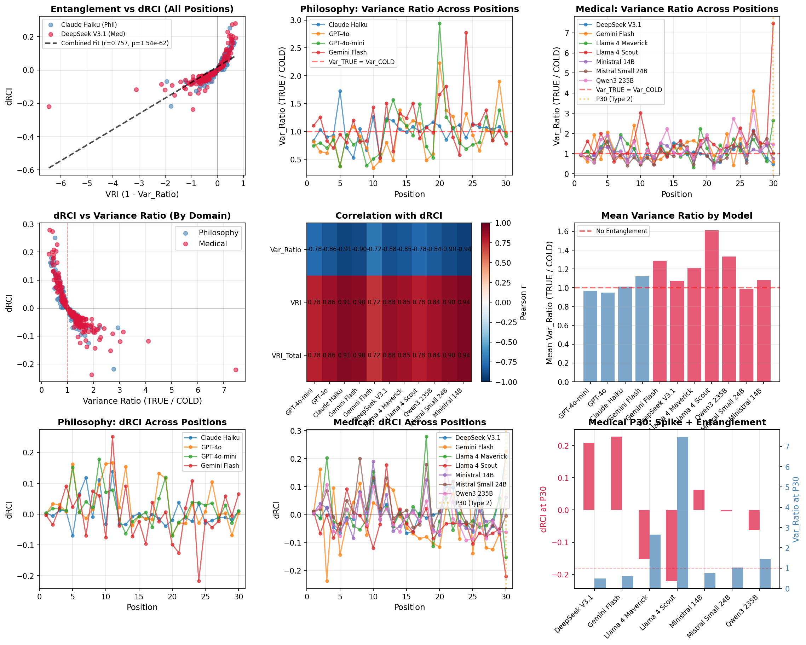

# Context Curves Behavior: Measuring AI Relational Dynamics with ΔRCI

[](https://arxiv.org/)
[](https://opensource.org/licenses/MIT)
[](https://www.python.org/downloads/)

**Expanded analyses (Paper 3/4): 22 model-domain runs, 99,000+ responses**
Paper 1 legacy summary (archived): `docs/Paper1_Archived_Summary.md`

*Dr. Laxman M M, MBBS | Primary Health Centre Manchi, Karnataka, India*

---

## Start here

- Paper 4 results: `docs/Paper4_Results_Discussion.md`
- Paper 3 results: `docs/Paper3_Results_Discussion.md`
- **Safety anomaly note (Llama P30):** `docs/Llama_Safety_Anomaly.md`
- Data availability index: `docs/data_availability_index.md`

**Featured figure:** Medical P30 entanglement spike (Llama divergence).



---

## Key Findings

### 1. Epistemological Relativity v2.0
Domain shapes *temporal dynamics* of context sensitivity:

| Domain | Temporal Pattern |
|--------|------------------|
| Philosophy | Inverted-U (positions 1-29) |
| Medical | U-shaped (positions 1-29) + Type-2 spike at P30 |

Historical note: legacy Paper 1 claims and dataset summaries are archived in `docs/Paper1_Archived_Summary.md`.

### 2. Vendor Signatures
Significant vendor-level differences in context utilization (F=6.52, p=0.0015)


---

## Quick Start

```bash
# Clone
git clone https://github.com/LaxmanNandi/MCH-Experiments.git
cd MCH-Experiments

# Install
pip install -r requirements.txt

# Run interactive explorer (no API keys needed)
cd app
streamlit run app.py
```

---

## Repository Structure

```
MCH-Experiments/
├── MCH_Paper1_arXiv.tex       # Paper source (LaTeX)
├── MCH_Paper1_arXiv.pdf       # Compiled paper
├── docs/Paper1_Archived_Summary.md  # Paper 1 legacy archive (historical)
├── figures/                   # Publication figures (7 figures)
├── app/
│   ├── app.py                 # Interactive Streamlit explorer
│   └── data/                  # Paper 1 explorer dataset (JSON)
│       ├── philosophy/        # 700 trials (7 models × 100) - Paper 1 dataset
│       └── medical/           # 300 trials (6 models × 50) - Paper 1 dataset
├── data/
│   ├── philosophy_results/    # Raw philosophy data
│   └── medical_results/       # Raw medical data
├── scripts/
│   └── verify_prompts.py      # Prompt uniformity verification
└── analysis/                  # Statistical analysis scripts
```

---

## The ΔRCI Metric

**Delta Relational Coherence Index** measures context sensitivity:

```
ΔRCI = RCI_TRUE - RCI_COLD
```

Where RCI = mean cosine similarity between a response and all other responses in the same condition.

### Three-Condition Protocol
1. **TRUE**: Full coherent conversation history
2. **COLD**: No history (fresh start each prompt)
3. **SCRAMBLED**: History present but randomized

### Pattern Classification
- **CONVERGENT** (ΔRCI > 0): History helps
- **NEUTRAL** (ΔRCI ≈ 0): History irrelevant
- **SOVEREIGN** (ΔRCI < 0): History hurts

---

## Citation

```bibtex
@article{laxman2026context,
  title={Context Curves Behavior: Measuring AI Relational Dynamics with {$\Delta$RCI}},
  author={Laxman, M M},
  journal={arXiv preprint arXiv:2026.xxxxx},
  year={2026}
}
```

---

## License

MIT License - see [LICENSE](LICENSE)

## Contact

- GitHub: [@LaxmanNandi](https://github.com/LaxmanNandi)
- Email: barlax5377@gmail.com
- ORCID: [0009-0009-0405-6531](https://orcid.org/0009-0009-0405-6531)
