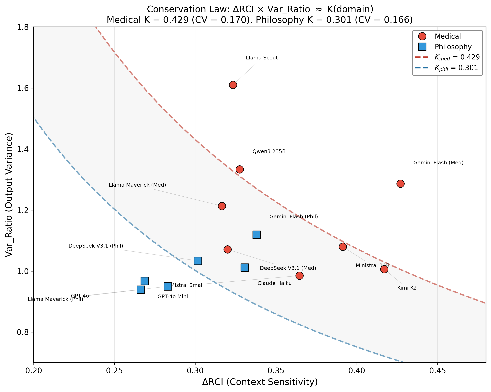

# MCH Research Program: Context Sensitivity in Large Language Models

## A Six-Paper Empirical Study Across 14 LLMs, 2 Domains, and 112,500 Responses

[](https://www.preprints.org/manuscript/202601.1881/v2)
[](https://www.preprints.org/manuscript/202602.1114/v2)
[](https://opensource.org/licenses/MIT)
[](https://www.python.org/downloads/)
[](#models-tested)
[](#methodology)

> **TL;DR:** We discover an empirical conservation constraint: the product of context sensitivity and output variance is approximately constant within a task domain, across all architectures tested. This emerges from a six-paper program measuring how 14 LLMs from 8 vendors process conversational context across medical and philosophical reasoning.

*Dr. Laxman M M, MBBS*
*Government Duty Medical Officer, PHC Manchi, Karnataka, India*
*DNB General Medicine Resident (2026), KC General Hospital, Bangalore*

---

## Research Program

| Paper | Title | Core Finding | Status |
|-------|-------|-------------|--------|
| **1** | Context Curves Behavior | ΔRCI metric validated | [Published](https://www.preprints.org/manuscript/202601.1881/v2) |
| **2** | Scaling Context Sensitivity | 14-model benchmark, 25 runs | [Published](https://www.preprints.org/manuscript/202602.1114/v2) |
| **3** | Cross-Domain Temporal Dynamics | Position-level analysis, Type 1 vs Type 2 | Submitted (Preprints.org ID: 199272, pending approval) |
| **4** | Entanglement and Variance Reduction | VRI mechanism, r=0.76 with ΔRCI | Draft complete |
| **5** | Predictability as Safety Metric | Four-class deployment taxonomy | Draft complete |
| **6** | Conservation Constraint | **ΔRCI × Var_Ratio ≈ K(domain)** | Draft complete |

### Key Discovery: Conservation Constraint (Paper 6)

```
ΔRCI × Var_Ratio ≈ K(domain)
```

| Domain | K | CV | N | 95% CI |
|--------|---|-----|---|--------|
| Medical (closed-goal) | 0.429 | 0.170 | 8 | [0.368, 0.490] |
| Philosophy (open-goal) | 0.301 | 0.166 | 6 | [0.248, 0.353] |

Domain difference: Mann-Whitney U = 46, p = 0.003, Cohen's d = 2.06

Context sensitivity and output variance trade off within a domain-specific capacity shaped by task structure. Each architecture allocates this capacity differently, but the product remains approximately constant within a domain.

---

## Key Findings

### 1. Domain Shapes Context Processing
- **Medical (closed-goal):** Diagnostic independence trough + integration rise (U-shape in 3-bin aggregation)
- **Philosophy (open-goal):** Mid-conversation peak + late decline (inverted-U in 3-bin aggregation)
- Raw 30-position curves are oscillatory; temporal patterns emerge under aggregation

### 2. Vendor Signatures
Significant vendor-level differences in context utilization (F=90.65, p<0.0001; persists excluding outliers: F(7,16)=3.55, p=0.017)

### 3. Entanglement Mechanism
Strong correlation between ΔRCI and VRI (r=0.76, p=1.5×10⁻⁶², N=330 position-level measurements), validating information-theoretic interpretation

### 4. Safety-Critical Divergence
Medical P30 task enablement reveals four behavioral classes:
- **IDEAL** (DeepSeek, Kimi K2): High accuracy, convergent outputs
- **EMPTY** (Gemini Flash): High accuracy, but outputs lack clinical detail
- **DIVERGENT** (Llama Scout/Maverick): Inconsistent outputs, high trial-to-trial variance
- **RICH** (Qwen3 235B): Moderate accuracy, verbose but informative

### 5. Conservation Constraint
All four predictability classes follow the hyperbolic constraint ΔRCI × Var_Ratio ≈ K. They represent different allocation strategies within the same domain-specific capacity.


*Figure: Conservation constraint across 14 model-domain runs. Models cluster along domain-specific hyperbolas despite spanning 8 vendors and parameter counts from 14B to 671B.*

---

## Models Tested

### Closed-Source (API)
| Model | Vendor | Domains |
|-------|--------|---------|
| GPT-4o | OpenAI | Medical, Philosophy |
| GPT-4o Mini | OpenAI | Medical, Philosophy |
| GPT-5.2 | OpenAI | Medical, Philosophy |
| Claude Opus | Anthropic | Medical |
| Claude Haiku | Anthropic | Medical, Philosophy |
| Gemini Flash | Google | Medical, Philosophy |

### Open-Source (via Together AI)
| Model | Vendor | Parameters | Domains |
|-------|--------|-----------|---------|
| DeepSeek V3.1 | DeepSeek | 671B | Medical, Philosophy |
| Qwen3 235B | Alibaba | 235B (22B active) | Medical, Philosophy |
| Llama 4 Maverick | Meta | 400B (17B active) | Medical, Philosophy |
| Llama 4 Scout | Meta | 109B (17B active) | Medical |
| Mistral Small 24B | Mistral | 24B | Medical |
| Ministral 14B | Mistral | 14B | Medical |
| Kimi K2 | Moonshot | 1T (32B active) | Medical |

**14 unique models, 8 vendors, 25 model-domain runs, 50 trials each = 112,500 responses**

---

## Repository Structure

```
mch_experiments/
├── papers/                          # Research manuscripts (by paper)
│   ├── paper1_legacy/               #   Paper 1: Published (Preprints.org)
│   ├── paper2_standardized/         #   Paper 2: Published (Preprints.org)
│   ├── paper3_cross_domain/         #   Paper 3: Temporal dynamics
│   ├── paper4_entanglement/         #   Paper 4: VRI mechanism
│   ├── paper5_safety/               #   Paper 5: Deployment taxonomy
│   └── paper6_conservation/         #   Paper 6: Conservation constraint
│
├── data/                            # Experimental data (single source of truth)
│   ├── medical/                     #   Medical domain (STEMI case)
│   │   ├── closed_models/           #     6 closed-source models
│   │   └── open_models/             #     7 open-source models
│   ├── philosophy/                  #   Philosophy domain (consciousness)
│   │   ├── closed_models/           #     5 closed-source models
│   │   └── open_models/             #     7 open-source models
│   ├── paper5/                      #   Accuracy verification data
│   └── paper6/                      #   Conservation constraint test data
│
├── scripts/                         # Analysis and experiment code
│   ├── experiments/                 #   Experiment runners
│   ├── analysis/                    #   Analysis scripts (Papers 3-6)
│   └── validate/                    #   Validation and verification
│
├── docs/                            # Documentation and figures
│   ├── figures/                     #   All figures by paper
│   │   ├── paper3/                  #     Paper 3 figures (8)
│   │   ├── paper4/                  #     Paper 4 figures (3)
│   │   ├── paper5/                  #     Paper 5 figures (6)
│   │   ├── paper6/                  #     Paper 6 figures (4 main + variants)
│   │   ├── publication/             #     Publication-ready composites
│   │   └── legacy/                  #     Archived earlier versions
│   └── figure_data/                 #   CSV data behind figures
│
└── archive/                         # Historical materials
    ├── arxiv_v1/                    #   Original arXiv submission
    ├── deprecated_scripts/          #   Superseded analysis code
    └── old_data/                    #   Paper 2 early exports
```

---

## Methodology

### ΔRCI (Delta Relational Coherence Index)

```
ΔRCI = mean(RCI_TRUE) - mean(RCI_COLD)
```

- **RCI_TRUE** = 1.0 (self-alignment under full context)
- **RCI_COLD** = cosine similarity between context-free and context-dependent responses
- Higher ΔRCI = greater context sensitivity

### Var_Ratio (Output Variance Ratio)

```
Var_Ratio = Var(TRUE embeddings) / Var(COLD embeddings)
```

- Var_Ratio > 1: Context increases output variability
- Var_Ratio < 1: Context constrains (entangles) outputs
- VRI = 1 - Var_Ratio (Variance Reduction Index)

### Experimental Protocol
- **3 conditions**: TRUE (coherent 29-message history), COLD (no context), SCRAMBLED (randomized)
- **50 trials** per model-domain configuration
- **30 prompts** per trial (positions P1-P30)
- **Temperature**: 0.7 (all models)
- **Embedding**: all-MiniLM-L6-v2 (384-dimensional sentence embeddings)

### Task Domains
- **Medical (closed-goal):** STEMI case progression with diagnostic and therapeutic prompts
- **Philosophy (open-goal):** Consciousness and phenomenology with recursive philosophical prompts

---

## Quick Start

```bash
# Clone
git clone https://github.com/LaxmanNandi/MCH-Research.git
cd MCH-Research

# Install dependencies
pip install -r requirements.txt

# Run conservation constraint test (Paper 6)
python scripts/analysis/paper6_conservation_product.py

# Generate Paper 6 figures
python scripts/analysis/paper6_figures.py

# Generate Paper 5 figures
python scripts/generate_paper5_figures.py
```

---

## Citation

### Paper 1
```bibtex
@article{laxman2026context,
  title={Context Curves Behavior: Measuring AI Relational Dynamics with {$\Delta$RCI}},
  author={Laxman, M M},
  journal={Preprints.org},
  doi={10.20944/preprints202601.1881.v2},
  year={2026}
}
```

### Paper 2
```bibtex
@article{laxman2026scaling,
  title={Scaling Context Sensitivity: A Standardized Benchmark of {$\Delta$RCI} Across 25 Model-Domain Runs},
  author={Laxman, M M},
  journal={Preprints.org},
  doi={10.20944/preprints202602.1114.v2},
  year={2026}
}
```

---

## Acknowledgments

See [CONTRIBUTORS.md](CONTRIBUTORS.md) for collaborator roles. Developed using Distributed Intelligence Architecture (DIA) with Claude Code and GPT-5.2 Codex assistance.

---

## License

MIT License — see [LICENSE](LICENSE) for details.

---

## Contact

**Dr. Laxman M M, MBBS**
Government Duty Medical Officer, PHC Manchi, Karnataka, India
DNB General Medicine Resident (2026), KC General Hospital, Bangalore
GitHub: [@LaxmanNandi](https://github.com/LaxmanNandi)
