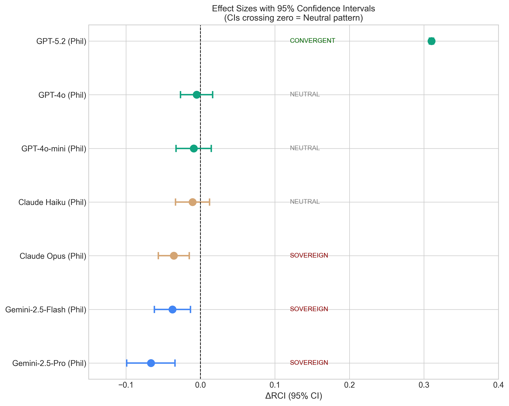

# Context Curves Behavior: Measuring AI Relational Dynamics with ΔRCI

[](https://arxiv.org/)
[](https://opensource.org/licenses/MIT)
[](https://www.python.org/downloads/)

**Large-scale analysis: 22 model-domain configurations, 99,000+ responses**

*Dr. Laxman M M, MBBS | Primary Health Centre Manchi, Karnataka, India*

---

## Start Here

- **Temporal Dynamics Results:** `docs/Results_Temporal_Dynamics.md`
- **Entanglement Analysis Results:** `docs/Results_Entanglement_Analysis.md`
- **Safety Anomaly Note (Llama P30):** `docs/Llama_Safety_Anomaly.md`
- **Data Availability Index:** `docs/data_availability_index.md`

**Why this matters:** Context effects in LLMs are not uniform; they change by position, domain, and task type. This repository provides reproducible evidence and a structured framework (taxonomy + dual-axis metrics) to distinguish when context improves reliability versus when it destabilizes it—critical for medical and safety-relevant applications.

**Featured Finding:** Position-dependent entanglement spike in medical summarization tasks reveals model-specific divergence patterns.


*Caption: P30 medical summarization produces outlier variance and divergence in specific models.*

---

## Key Findings

### 1. Epistemological Relativity v2.0
Domain shapes temporal dynamics of context sensitivity:

| Domain | Temporal Pattern |
|--------|------------------|
| Philosophy (open-goal) | Inverted-U curve (positions 1-29) |
| Medical (closed-goal) | U-shaped curve (positions 1-29) + Type-2 spike at P30 |

### 2. Vendor Signatures
Significant vendor-level differences in context utilization (F=6.52, p=0.0015).



### 3. Mutual Information Entanglement
Strong correlation (r=0.74, p<10⁻⁴²) between ΔRCI and mutual information proxy across 240 position-level measurements, validating information-theoretic interpretation.

---

## Repository Structure

```
mch_experiments/
├── data/                           # Experiment results (JSON format)
│   ├── medical_results/            # Medical reasoning tasks
│   ├── open_medical_rerun/         # Open model medical reruns
│   ├── open_model_results/         # Open model philosophy tasks
│   └── closed_model_philosophy_rerun/
├── docs/                           # Documentation and results
│   ├── Results_Temporal_Dynamics.md
│   ├── Results_Entanglement_Analysis.md
│   ├── Claims_Evidence_Entanglement.md
│   ├── Methods_Entanglement.md
│   └── figures/                    # Publication figures
├── scripts/                        # Experiment runners
│   ├── mch_open_models_medical_rerun.py
│   ├── validate/                   # Analysis and validation scripts
│   └── paper3_generate_figures.py
└── analysis/                       # Generated analysis outputs
    ├── trial_level_drci.csv
    └── entanglement_position_data.csv
```

---

## Quick Start

```bash
# Clone
git clone https://github.com/LaxmanNandi/MCH-Experiments.git
cd MCH-Experiments

# Install
pip install -r requirements.txt

# Run analysis
python scripts/validate/extract_and_analyze_trial_level.py

# Generate figures
python scripts/paper3_generate_figures.py
```

---

## Methodology

### Delta Relational Coherence Index (ΔRCI)

ΔRCI measures how context affects response consistency:

```
ΔRCI = mean(RCI_TRUE) - mean(RCI_COLD)
```

Where:
- **RCI_TRUE**: Self-similarity of responses within true context (≈1.0)
- **RCI_COLD**: Cross-similarity between true and scrambled context responses

**Interpretation:**
- ΔRCI > 0: Context increases coherence (positive dependence)
- ΔRCI ≈ 0: Context-independent generation
- ΔRCI < 0: Context decreases coherence (rare; suggests instability)

### Task Types

- **Type 1 (Open-goal):** Philosophy prompts, no single correct answer
- **Type 2 (Closed-goal):** Medical reasoning, diagnostic/therapeutic targets

### Embedding Model
All semantic similarity computed using `sentence-transformers/all-MiniLM-L6-v2` (384-dim).

---

## Models Tested

### Closed (API-based)
- GPT-4o, GPT-4o-mini, GPT-5.2
- Claude Opus, Claude Haiku
- Gemini Flash, Gemini 2.5 Pro

### Open (Self-hosted)
- DeepSeek V3.1, Qwen3 235B
- Llama 4 Maverick, Llama 4 Scout
- Mistral Small 24B, Ministral 14B
- Kimi K2

---

## Citation

```bibtex
@article{nandi2026context,
  title={Context Curves Behavior: Measuring AI Relational Dynamics with ΔRCI},
  author={Nandi, Laxman M M},
  journal={arXiv preprint arXiv:2026.xxxxx},
  year={2026}
}
```

---

## Acknowledgments

See `CONTRIBUTORS.md` for collaborator roles and contributions.

Developed using Distributed Intelligence Architecture (DIA) with Claude Code and GPT-5.2 Codex assistance.

---

## License

MIT License - see `LICENSE` for details.

---

## Contact

**Dr. Laxman M M, MBBS**
Primary Health Centre Manchi, Karnataka, India
Email: barlax5377@gmail.com
GitHub: [@LaxmanNandi](https://github.com/LaxmanNandi)
