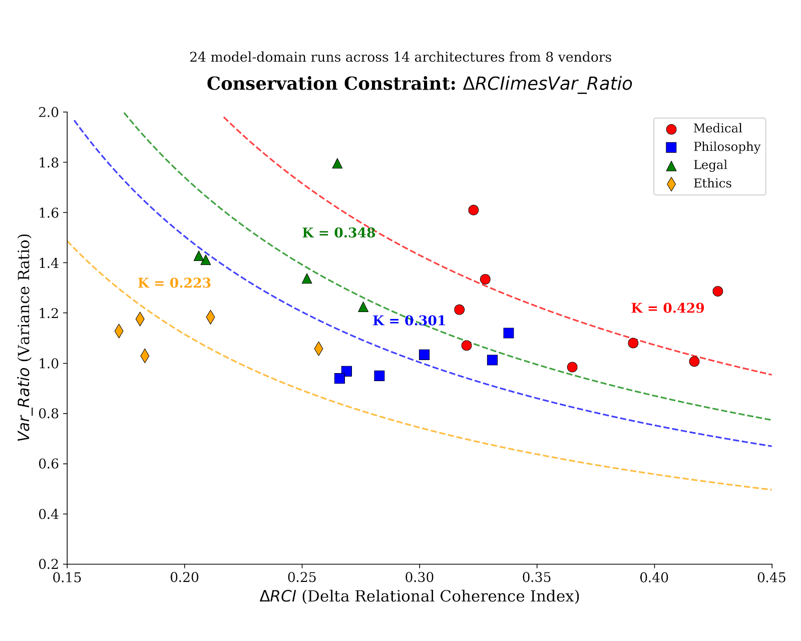

# MCH Research Program: Context Sensitivity in Large Language Models

## A Nine-Paper Research Program Across 14 LLMs, 4 Domains, and 160,000+ Responses

[](https://www.preprints.org/manuscript/202601.1881/v2)
[](https://www.preprints.org/manuscript/202602.1114/v2)
[](https://www.preprints.org/manuscript/202602.1674/v1)
[](https://www.preprints.org/manuscript/202603.0055/v1)
[](https://www.preprints.org/manuscript/202602.2034/v1)
[](https://www.preprints.org/manuscript/202603.1116/v1)
[](https://www.preprints.org/manuscript/202604.0061/v1)
[](https://doi.org/10.5281/zenodo.19466613)
[](https://opensource.org/licenses/MIT)
[](https://www.python.org/downloads/)
[](#models-tested)
[](#methodology)

> **TL;DR:** We report an **empirical conservation constraint** in LLM context processing: the product of context sensitivity (ΔRCI) and output variance (Var_Ratio) is approximately constant within an epistemological domain. The domain's truth-type determines the mode of context processing — including the conservation constant K, the presence or absence of entanglement, and the convergence or divergence of response space. Validated across four domains (Medical, Legal, Philosophy, Applied Ethics) spanning four truth-types (Discovered, Argued, Explored, Felt), 14+ LLMs from 8 vendors, and 160,000+ responses.

*Dr. Laxman M M, MBBS*
*Government Duty Medical Officer, PHC Manchi, Karnataka, India*
*DNB General Medicine Resident (2026), KC General Hospital, Bangalore*

---

## Research Program

| Paper | Title | Core Finding | Status |
|-------|-------|-------------|--------|
| **1** | Context Curves Behavior | ΔRCI metric validated | ✅ [Published](https://www.preprints.org/manuscript/202601.1881/v2) - DOI: 10.20944/preprints202601.1881.v2 |
| **2** | Scaling Context Sensitivity | 14-model benchmark, 25 runs | ✅ [Published v2](https://www.preprints.org/manuscript/202602.1114/v2) - DOI: 10.20944/preprints202602.1114.v2 |
| **3** | Domain-Specific Temporal Dynamics | 3-bin aggregation, U-shape vs inverted-U | ✅ [Published](https://www.preprints.org/manuscript/202602.1674/v1) - DOI: 10.20944/preprints202602.1674.v1 |
| **4** | Engagement as Entanglement | VRI mechanism, r=0.76, ESI metric | ✅ [Published](https://www.preprints.org/manuscript/202603.0055/v1) (Preprints.org). Next venue under consideration. |
| **5** | Stochastic Incompleteness | Four-class deployment taxonomy (IDEAL/EMPTY/DIVERGENT/RICH) | ✅ [Published](https://www.preprints.org/manuscript/202602.2034/v1) - DOI: 10.20944/preprints202602.2034.v1 |
| **6** | **Conservation Constraint (Capstone)** | **ΔRCI × Var_Ratio ≈ K(domain)** — empirical conservation constraint, four truth-types | 📦 Preprints.org declined twice (IDs 207501, 208191). Planned for Zenodo. Manuscript and unified pipeline complete. |
| **7** | Content-Order Decomposition | Decomposes ΔRCI into content/order; exploration arc | ✅ [Published](https://www.preprints.org/manuscript/202603.1116/v1) - DOI: 10.20944/preprints202603.1116.v1 |
| **8** | Encoding Fidelity & Coherent Misalignment | EFI metric; Coherent Misalignment; Dravidian-specific variance | ✅ [Published](https://www.preprints.org/manuscript/202604.0061/v1) - DOI: 10.20944/preprints202604.0061.v1. Scientific Reports (Nature portfolio): under peer review. |
| **9** | Measurement Matters | EFI is embedding-dependent (0.08→0.85); MuRIL degeneracy; variance is LLM-intrinsic | ✅ [Published](https://doi.org/10.5281/zenodo.19466613) - Zenodo DOI: 10.5281/zenodo.19466613 |

### Key Discovery: Conservation Constraint (Paper 6 — Capstone)

```
ΔRCI × Var_Ratio ≈ K(domain)
```

| Domain | Truth Type | K | CV | N | Entangled | Arc |
|--------|-----------|------|------|---|-----------|-----|
| Medical | Discovered | 0.429 | 0.170 | 8 | Yes (r=0.76) | Convergent |
| Legal | Argued | 0.348 | 0.214 | 5 | No (all ns) | Convergent |
| Philosophy | Explored | 0.301 | 0.166 | 6 | Yes (r=0.76) | Divergent |
| Ethics | Felt | 0.223 | 0.162 | 5 | Mixed | Mixed |

**K ordering: Discovered > Argued > Explored > Felt.** The more subjective the truth-type, the lower K. CV ≈ 0.17 in all four domains — conservation is equally tight regardless of K value.

Domain difference (Medical vs Philosophy): Mann-Whitney U = 46, p = 0.003, Cohen's d = 2.06

The domain's truth-type determines the full behavioural mode: conservation constant, entanglement structure, exploration arc, temporal dynamics, and content-order balance. Each architecture allocates capacity differently, but the product K remains approximately constant within a domain.

---

## Key Findings

### 1. Conservation Law: ΔRCI × Var_Ratio ≈ K(domain)
The product of context sensitivity and output variance is approximately constant within a domain, across all architectures tested. Four domains, four truth-types, one conservation law:
- **Medical (Discovered truth):** K = 0.429 — fixed answers exist, context converges toward them
- **Legal (Argued truth):** K = 0.348 — answers constructed through structure, not discovered
- **Philosophy (Explored truth):** K = 0.301 — open inquiry, no fixed answer
- **Applied Ethics (Felt truth):** K = 0.223 — moral commitment, context individuates

Within-domain CV ≈ 0.17 in all four domains. Between-domain: Mann-Whitney U=46, p=0.003, Cohen's d=2.06 (Medical vs Philosophy).

### 2. Four-Mode Taxonomy of Context Processing
Each truth-type determines a distinct behavioural mode:
- **Discovered** (Medical): Entangled (r=0.76), convergent arc (1.72), P30 spike (all z>2.43), U-shape temporal
- **Argued** (Legal): NOT entangled (all r ns), convergent arc, no P30 spike, mixed temporal — convergence WITHOUT entanglement
- **Explored** (Philosophy): Entangled (r=0.76), divergent arc (15.23), no P30 spike, inverted-U temporal
- **Felt** (Ethics): Mixed entanglement (model-dependent), mixed arc, Var_Ratio <1 (unique), SCRAMBLED ≈ COLD (order IS the reasoning)

### 3. Theoretical Hierarchy
Conservation > Entanglement > Temporal dynamics. K holds in all domains. Entanglement is domain-dependent (present in Medical/Philosophy, absent in Legal, mixed in Ethics). Temporal patterns are surface manifestations.

### 4. Content-Order Decomposition (Paper 7)
ΔRCI decomposes into content and order components via SCRAMBLED condition:
- Content fraction: Medical 45-55%, Philosophy 35-55%, Legal ~70-80%, Ethics 80-91%
- Exploration Arc: Medical 1.72±0.68 (convergent) vs Philosophy 15.23±16.64 (divergent) — zero overlap
- Llama P30 safety anomaly driven entirely by order component, not content

### 5. Safety Taxonomy (Paper 5)
Four deployment classes based on Var_Ratio × Accuracy:
- **IDEAL** (DeepSeek, Kimi K2): Deployable — high accuracy, convergent
- **EMPTY** (Gemini Flash): Dangerous — converges but 16% accuracy
- **DIVERGENT** (Llama Scout/Maverick): Unreliable — high variance, Var_Ratio up to 7.46
- **RICH** (Qwen3 235B): Promising — high variance but 95% accuracy

### 6. Entanglement Mechanism (Paper 4)
ΔRCI and VRI correlate at r=0.76, p=2.37×10⁻⁶⁸ (N=360 position-level measurements). Context sensitivity and variance reduction are bidirectionally coupled — a special case of the conservation law, present in Discovered and Explored domains, absent in Argued domains.

### 7. Encoding Fidelity Failure (Paper 8)
Shannon's encoding fidelity assumption fails for non-English LLMs:
- EFI: Kannada 0.099, Tamil 0.069, Hindi 0.076 (all p < 10⁻¹³ vs English)
- European control: German/French significantly higher (d=1.33) — degradation is Dravidian-specific
- Variance amplification: Kannada 1.72–2.05× (p<0.05)
- Coherent Misalignment: fluent, confident, semantically wrong outputs — a new failure mode
### 8. Measurement Matters (Paper 9)
EFI is embedding-dependent — the measured encoding fidelity gap varies 10× depending on embedding model:
- **MiniLM (384D):** Kannada EFI = 0.081 — the Paper 8 finding
- **MPNet (768D):** Kannada EFI = 0.151 — slightly better
- **LaBSE (768D):** Kannada EFI = 0.853 — **nearly script-invariant**
- **MuRIL:** DEGENERATE — cosine ~0.999 for all inputs including random strings
- LaBSE closes Indic-European gap from 0.33 to 0.035
- **But variance amplification persists** across all embedding models (bootstrap 95% CIs, 10K iterations) — variance is LLM-intrinsic, not a measurement artifact
- **EFI and variance are INDEPENDENT phenomena** — different causes, different solutions

### 9. Programme Scale
- **160,000+ responses** across 4 domains, 14+ architectures, 8 vendors
- **50 trials** per model-domain configuration, **30 positions**, **3 conditions** (TRUE/COLD/SCRAMBLED)
- **24 model-domain runs** with complete data
- **9 papers** across the programme (8 with permanent DOIs; Paper 6 declined by Preprints.org twice, headed to Zenodo)
- **768D robustness check** confirms K holds across embedding dimensions
- All data, scripts, and analysis publicly available in this repository


*Figure: Conservation constraint across 24 model-domain runs in four epistemological domains. Models cluster along domain-specific hyperbolas (K = 0.429 Medical, 0.348 Legal, 0.301 Philosophy, 0.223 Ethics) despite spanning 14+ architectures from 8 vendors.*

---

## Models Tested

### Closed-Source (API)
| Model | Vendor | Domains |
|-------|--------|---------|
| GPT-4o | OpenAI | Medical, Philosophy |
| GPT-4o Mini | OpenAI | Medical, Philosophy |
| GPT-5.2 | OpenAI | Medical, Philosophy |
| Claude Opus | Anthropic | Medical |
| Claude Haiku | Anthropic | Medical, Philosophy |
| Gemini Flash | Google | Medical, Philosophy |

### Open-Source (via Together AI)
| Model | Vendor | Parameters | Domains |
|-------|--------|-----------|---------|
| DeepSeek V3.1 | DeepSeek | 671B | Medical, Philosophy, Legal, Ethics |
| Qwen3 235B | Alibaba | 235B (22B active) | Medical, Philosophy, Legal, Ethics |
| Llama 4 Maverick | Meta | 400B (17B active) | Medical, Philosophy, Legal, Ethics |
| Llama 4 Scout | Meta | 109B (17B active) | Medical |
| Llama 3.3 70B Turbo | Meta | 70B | Legal, Ethics |
| Mistral Small 24B | Mistral | 24B | Medical, Legal, Ethics |
| Ministral 14B | Mistral | 14B | Medical |
| Kimi K2 | Moonshot | 1T (32B active) | Medical |

**14+ unique models, 8 vendors, 4 domains, 24 model-domain runs = 160,000+ responses**

---

## Repository Structure

```
mch_experiments/
├── papers/                          # Research manuscripts (by paper)
│   ├── paper1_legacy/               #   Paper 1: Published (Preprints.org)
│   ├── paper2_standardized/         #   Paper 2: Published (Preprints.org)
│   ├── paper3_cross_domain/         #   Paper 3: Published (Preprints.org)
│   ├── paper4_entanglement/         #   Paper 4: Published (Preprints.org); next venue under consideration
│   ├── paper5_safety/               #   Paper 5: Published (Preprints.org)
│   ├── paper6_conservation/         #   Paper 6: Preprints.org declined ×2; planned for Zenodo
│   ├── paper7_submission/           #   Paper 7: Published (tex, pdf, figures/, archive/)
│   ├── paper8_efi/                  #   Paper 8: Published + Scientific Reports (under peer review)
│   └── paper9_measurement/          #   Paper 9: Published (Zenodo DOI: 10.5281/zenodo.19466613)
│
├── data/                            # Experimental data (single source of truth)
│   ├── medical/                     #   Medical domain (STEMI case)
│   │   ├── closed_models/           #     6 closed-source models
│   │   └── open_models/             #     7 open-source models
│   ├── philosophy/                  #   Philosophy domain (consciousness)
│   │   ├── closed_models/           #     5 closed-source models
│   │   └── open_models/             #     7 open-source models
│   ├── paper5/                      #   Accuracy verification data
│   ├── paper6/                      #   Conservation constraint + 768D robustness
│   ├── paper7/                      #   Paper 7 cold prior voice analysis
│   ├── paper9/                      #   Paper 9 validation experiments (A through G)
│   ├── legal/                       #   Legal domain (N=5, complete)
│   └── ethics/                      #   Applied Ethics domain (N=5, complete)
│
├── scripts/                         # Analysis and experiment code (by paper)
│   ├── paper3/                      #   Paper 3 verification
│   ├── paper6/                      #   Paper 6 conservation law (15 scripts)
│   ├── paper7/                      #   Paper 7 claims verification
│   ├── paper8/                      #   Paper 8 EFI analysis (5 scripts)
│   ├── paper9/                      #   Paper 9 validation experiments
│   ├── eeg_pilot/                   #   EEG biological pilot
│   ├── shared/                      #   Cross-paper utilities
│   ├── experiments/                 #   Domain experiment runners
│   └── archive/                     #   Historical scripts (Papers 1-5, utilities)
│
├── docs/                            # Documentation and figures
│   ├── figures/                     #   All figures by paper
│   ├── figure_data/                 #   CSV data behind figures
│   └── archive/                     #   Historical working documents
│
├── related_work/                    # Contemporary research landscape snapshot
│
└── archive/                         # Historical materials
```

See [`related_work/`](related_work/) for a maintained snapshot of the
contemporary research landscape — multilingual clinical AI, multi-turn
LLM evaluation, interpretability and fidelity measurement, misalignment
and AI safety, and Indian-language AI infrastructure — including how
each work intersects with the MCH program.

---

## Methodology

### ΔRCI (Delta Relational Coherence Index)

```
ΔRCI = mean(RCI_TRUE) - mean(RCI_COLD)
```

- **RCI_TRUE** = 1.0 (self-alignment under full context)
- **RCI_COLD** = cosine similarity between context-free and context-dependent responses
- Higher ΔRCI = greater context sensitivity

### Var_Ratio (Output Variance Ratio)

```
Var_Ratio = Var(TRUE embeddings) / Var(COLD embeddings)
```

- Var_Ratio > 1: Context increases output variability
- Var_Ratio < 1: Context constrains (entangles) outputs
- VRI = 1 - Var_Ratio (Variance Reduction Index)

### Experimental Protocol
- **3 conditions**: TRUE (coherent 29-message history), COLD (no context), SCRAMBLED (randomized)
- **50 trials** per model-domain configuration
- **30 prompts** per trial (positions P1-P30)
- **Temperature**: 0.7 (all models)
- **Embedding**: all-MiniLM-L6-v2 (384-dimensional sentence embeddings)

### Task Domains — Four Truth-Types
- **Medical (Discovered truth):** STEMI case progression with diagnostic and therapeutic prompts — K=0.429
- **Philosophy (Explored truth):** Consciousness and phenomenology with recursive philosophical prompts — K=0.301
- **Legal (Argued truth):** Employment law dispute with whistleblower retaliation — K=0.348
- **Applied Ethics (Felt truth):** Moral reasoning across healthcare, technology, and global justice — K=0.223

---

## Quick Start

```bash
# Clone
git clone https://github.com/LaxmanNandi/MCH-Research.git
cd MCH-Research

# Install dependencies
pip install -r requirements.txt

# Run conservation constraint test (Paper 6)
python scripts/paper6/paper6_conservation_product.py

# Generate Paper 6 figures
python scripts/paper6/paper6_figures.py

# Compile Paper 6 manuscript data from raw trials
python scripts/paper6/compile_paper6_data.py
```

---

## Citation

### Paper 1
```bibtex
@article{laxman2026context,
  title={Context Curves Behavior: Measuring AI Relational Dynamics with {$\Delta$RCI}},
  author={Laxman, M M},
  journal={Preprints.org},
  doi={10.20944/preprints202601.1881.v2},
  year={2026}
}
```

### Paper 2
```bibtex
@article{laxman2026scaling,
  title={Scaling Context Sensitivity: A Standardized Benchmark of {$\Delta$RCI} Across 25 Model-Domain Runs},
  author={Laxman, M M},
  journal={Preprints.org},
  doi={10.20944/preprints202602.1114.v2},
  year={2026}
}
```

### Paper 3
```bibtex
@article{laxman2026temporal,
  title={Domain-Specific Temporal Dynamics of Context Sensitivity in Large Language Models},
  author={Laxman, M M},
  journal={Preprints.org},
  doi={10.20944/preprints202602.1674.v1},
  year={2026}
}
```

### Paper 4
```bibtex
@article{laxman2026entanglement,
  title={Engagement as Entanglement: Variance Signatures of Bidirectional Context Coupling in Large Language Models},
  author={Laxman, M M},
  journal={Preprints.org},
  doi={10.20944/preprints202603.0055.v1},
  year={2026}
}
```

### Paper 5
```bibtex
@article{laxman2026stochastic,
  title={Stochastic Incompleteness: A Predictability Taxonomy for Clinical AI Deployment},
  author={Laxman, M M},
  journal={Preprints.org},
  doi={10.20944/preprints202602.2034.v1},
  year={2026}
}
```

### Paper 6
```bibtex
@article{laxman2026conservation,
  title={A Conservation Constraint in {LLM} Context Processing Across Four Epistemological Domains},
  author={Laxman, M M},
  journal={Preprints.org},
  note={Submitted; Zenodo deposit planned},
  year={2026}
}
```

### Paper 7
```bibtex
@article{laxman2026decomposition,
  title={The Structure and Trajectory of Context Sensitivity in {LLMs}: Content-Order Decomposition and Variance Dissociation},
  author={Laxman, M M},
  journal={Preprints.org},
  doi={10.20944/preprints202603.1116.v1},
  year={2026}
}
```

### Paper 8
```bibtex
@article{laxman2026encoding,
  title={Encoding Fidelity and Coherent Misalignment in Non-English Clinical {AI}},
  author={Laxman, M M},
  journal={Preprints.org},
  doi={10.20944/preprints202604.0061.v1},
  year={2026}
}
```

### Paper 9
```bibtex
@article{laxman2026measurement,
  title={Measurement Matters: Embedding Model Choice Determines Encoding Fidelity Assessment in Multilingual Clinical {AI}},
  author={Laxman, M M},
  journal={Zenodo},
  doi={10.5281/zenodo.19466613},
  year={2026}
}
```

---

## Acknowledgments

See [CONTRIBUTORS.md](CONTRIBUTORS.md) for collaborator roles. Developed using Distributed Intelligence Architecture (DIA) with Claude Code and GPT-5.2 Codex assistance.

---

## License

MIT License — see [LICENSE](LICENSE) for details.

---

## Contact

**Dr. Laxman M M, MBBS**
Government Duty Medical Officer, PHC Manchi, Karnataka, India
DNB General Medicine Resident (2026), KC General Hospital, Bangalore
GitHub: [@LaxmanNandi](https://github.com/LaxmanNandi)
