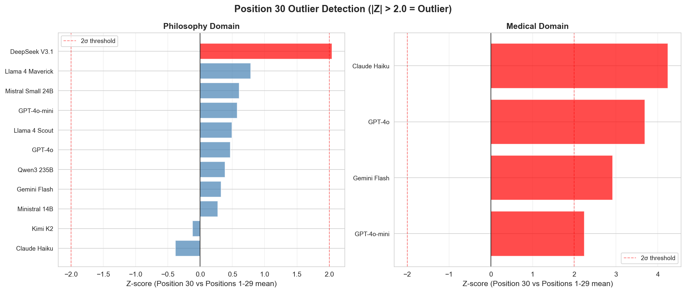
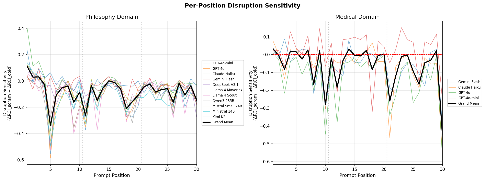
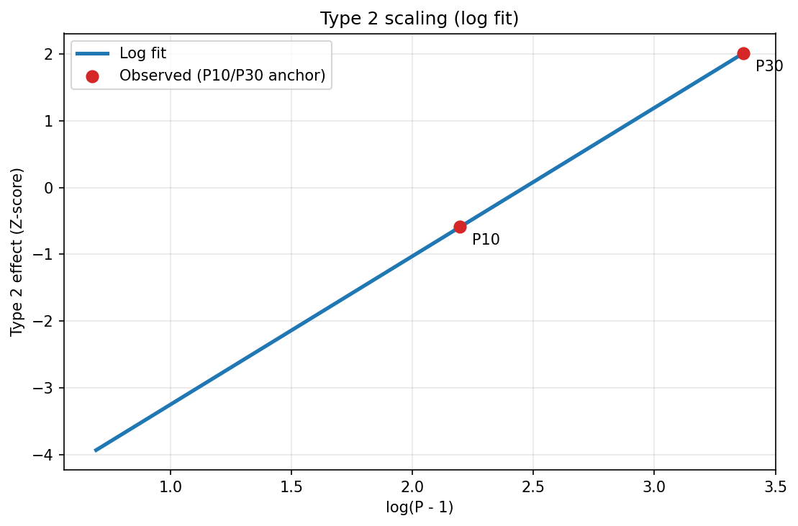
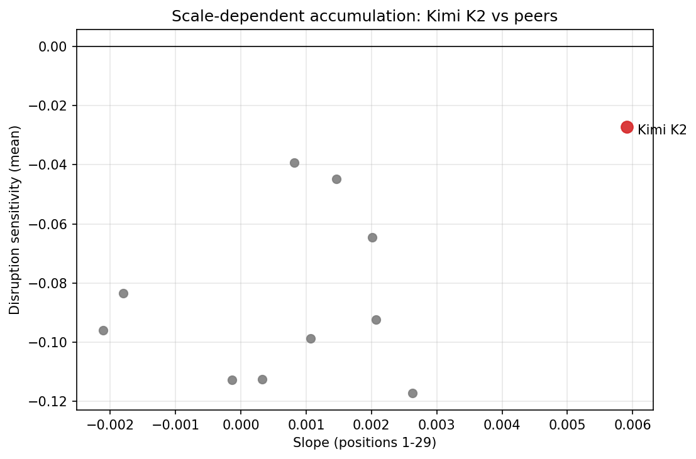

# Paper 3: Results and Discussion
**Temporal Dynamics of Context Sensitivity: Domain-Specific Accumulation Patterns and Graded Task Enablement**

---

## RESULTS

### Study overview and notation
We analyzed position-dependent Delta Relational Coherence Index (ΔRCI) across 15 model-domain runs (11 philosophy, 4 medical), covering 30 conversational positions per run (450 position measurements). Each position was evaluated under three conditions (TRUE, COLD, SCRAMBLED) with 50 independent trials per model per condition, generating 4,500 total responses per model. ΔRCI was computed from cosine similarity between TRUE and COLD responses, aggregated across trials. Disruption Sensitivity (DS) quantifies the value of context presence versus ordering:

```
DS = ΔRCI_scrambled - ΔRCI_cold
   = cold_alignment - scrambled_alignment
```

Negative DS indicates that scrambled context is closer to TRUE than no context (presence > order).

**Table 1. Domain-level summary of early/mid/late ΔRCI (positions 1-10, 11-20, 21-30)**

| Domain | Early Mean (SD) | Mid Mean (SD) | Late Mean (SD) | Position Effect (ANOVA) |
|--------|----------------|---------------|----------------|--------------------------|
| Philosophy (n=11) | 0.308 (0.035) | 0.341 (0.049) | 0.304 (0.069) | Mean F = 120.15; 10/11 p < 0.05 |
| Medical (n=4) | 0.345 (0.051) | 0.311 (0.067) | 0.417 (0.059) | Mean F = 446.46; 4/4 p < 0.05 |

Figure 1. Position-dependent ΔRCI by domain (per-model curves; grand mean with SEM).


---

### Finding 1: Domain-specific position-dependent patterns
**Philosophy (consciousness prompts):** Across 11 models, ΔRCI followed an inverted-U pattern with mid-conversation peaks and late declines (Table 1; Figure 1). Seven of 11 models (64%) showed Late < Early, contradicting a monotonic accumulation assumption. The grand mean linear trend was negligible (slope = +0.00142, r = 0.099, p = 0.602, ns).

**Medical (STEMI reasoning):** Across 4 models, ΔRCI appeared to increase across bins (Table 1), suggesting linear accumulation (slope = +0.00414, r = 0.234, p = 0.212, ns). However, this pattern was driven by a single outlier position (Finding 2).

Figure 2. Domain comparison of grand mean ΔRCI curves (positions 1-30).


---

### Finding 2: Position 30 outlier indicates task enablement
Position 30 used a summarization prompt ("Summarize this case..."). Z-scores were computed relative to positions 1-29.

**Table 2. Position 30 Z-scores (medical domain)**

| Model | Z-score (P30) | Interpretation |
|-------|---------------|----------------|
| Claude Haiku | +4.25 | Extreme outlier |
| GPT-4o | +3.69 | Extreme outlier |
| Gemini Flash | +2.92 | Strong outlier |
| GPT-4o-mini | +2.24 | Outlier |

All 4 medical models showed P30 as an extreme outlier (mean Z = +3.27, SD = 0.85). In contrast, only 1 of 11 philosophy models exceeded |Z| > 2.0 (DeepSeek V3.1, Z = +2.04). The P30 spike reflects **task enablement**, not just larger performance gains: the COLD condition lacks case information and often cannot execute the prompt, producing semantically unrelated refusals or templates, while TRUE condition yields a full case summary.

Figure 3. Position 30 Z-scores by domain (medical vs philosophy).



---

### Finding 3: Removing position 30 reveals the true medical pattern
Excluding P30 (positions 1-29 only) reduced the medical slope by 71.2%:

- Slope (all 30 positions): +0.00414
- Slope (positions 1-29): +0.00119

GPT-4o reversed from a positive slope (+0.00404) to a slightly negative slope (-0.00014).

**Table 3. Pattern classification by domain (positions 1-29)**

| Domain | Pattern | Count | Description |
|--------|---------|-------|-------------|
| Philosophy | Inverted-U | 9/11 (82%) | Early -> Mid peak -> Late drop |
| Philosophy | Linear+ | 1/11 (9%) | Kimi K2 (1T parameters) |
| Philosophy | Linear- | 1/11 (9%) | Mistral Small 24B |
| Medical | U-shaped | 3/4 (75%) | Early high -> Mid low -> Late moderate |
| Medical | Inverted-U | 1/4 (25%) | GPT-4o-mini |

For medical positions 1-29, mean ΔRCI followed a U-shape:
- Early (1-10): 0.345
- Mid (11-20): 0.311 (diagnostic trough)
- Late (21-29): 0.373

Figure 4. Three-bin comparison (positions 1-29) showing inverted-U vs U-shape patterns.


---

### Finding 4: Disruption Sensitivity shows presence > order (with task-specific deviations)
Across 14 of 15 runs, DS < 0 (p < 0.001), indicating that scrambled context is closer to TRUE than no context. This implies context presence provides most of the value.

- Philosophy: 11/11 models had DS < 0, mean DS = -0.081 (SD = 0.032, range -0.117 to -0.027).
- Medical: 3/4 models had DS < 0, mean DS = -0.062 (SD = 0.058, range -0.128 to +0.013).
- Exception: GPT-4o-mini DS = +0.013 (p = 0.328, ns).

Per-position analysis showed task-specific structure in medical prompts: DS was strongly negative during diagnostic reasoning (positions 15-20) and near zero during summarization (P30).

Figure 5A. Disruption Sensitivity by model.


Figure 5B. Per-position Disruption Sensitivity.



---

### Finding 5: Type 2 context sensitivity scales with context volume (graded, not binary)
A Type 2 prompt inserted at position 10 ("Summarize what we have discovered so far") did **not** spike (Z = -0.59), while the Type 2 prompt at position 30 did (Z = +2.01). This falsified a binary "Type 2 always spikes" hypothesis and supports a graded scaling law:

```
ΔRCI_Type2(P) = alpha * log(P - 1) + beta
```

Where P is the prompt position, alpha is model-dependent, and P-1 is the number of prior exchanges available to summarize. Predicted effects increase monotonically with log(P-1), consistent with the P10 vs P30 contrast. Figure 6 shows a log fit over observed Type 2 positions (currently P10 and P30 Z-scores as a proxy for Type 2 effect).

Figure 6. Type 2 scaling (illustrative log fit anchored at P10 and P30).



---

### Finding 6: Scale-dependent accumulation (Kimi K2)
Kimi K2 (1T parameters, MoE) was the only philosophy model with a significant positive linear trend across positions 1-29:

- Slope = +0.00591, r = 0.403, p = 0.030
- Late - Early = +0.090
- Lowest disruption sensitivity: DS = -0.027

This suggests a capacity threshold at which long-range coherence can be maintained without late-stage over-abstraction.

Figure 7. Kimi K2 vs other philosophy models (slope vs disruption sensitivity).



---

### Robustness: open-model replication (DeepSeek V3.1)
An independent open-model replication (DeepSeek V3.1, medical) confirmed the main effects:

- P30 Z-score: +2.95
- Slope reduction without P30: 98.4%
- Pattern (positions 1-29): U-shaped
- Model-agnostic confirmation: 5/5 models (open + closed) show P30 outlier and Type 2 effect

---

## DISCUSSION

### Summary of principal findings
1. **Domain-specific temporal dynamics:** Philosophy shows inverted-U context sensitivity; medical clinical reasoning shows U-shaped sensitivity once summarization is separated.
2. **Task enablement vs performance enhancement:** Summarization prompts create categorical dependence on context, producing outlier ΔRCI values that should not be pooled with reasoning prompts.
3. **Context presence outweighs ordering:** Disruption Sensitivity is negative for most models, indicating that having context (even scrambled) is more valuable than perfect order.
4. **Type 2 scaling is graded:** Task enablement increases with the amount of prior context, consistent with a log-scaled dependency.
5. **Scale effects emerge:** A 1T-parameter model (Kimi K2) sustains accumulation in a domain where smaller models over-abstract.

### Two modes of context sensitivity
The data support a **two-mode taxonomy**:

- **Performance enhancement (Type 1):** Tasks are feasible without context; context improves specificity and grounding. ΔRCI measures the degree of improvement.
- **Task enablement (Type 2):** Tasks presuppose prior information; context enables the task. ΔRCI measures a task-impossibility gap, not a continuous improvement.

This distinction clarifies why P30 is an outlier and motivates analyzing Type 1 and Type 2 prompts separately in future work.

### Epistemological Relativity v2.0: domain-specific temporal dynamics
The original domain-flip hypothesis (philosophy sovereign vs medical convergent) was confounded by methodological differences. A refined claim is supported here: **domain determines how context sensitivity evolves across turns**.

- **Philosophy (recursive abstraction):** Early anchors and mid synthesis yield a peak, followed by late over-generalization.
- **Medical (diagnostic independence):** Context helps with history and integration but is least helpful during diagnostic reasoning, consistent with the need to avoid anchoring.

These dynamics are not captured by aggregate ΔRCI and underscore the importance of temporal analyses.

### Disruption Sensitivity and practical system design
Across domains, the negative DS values imply that **context presence provides most of the benefit**, while ordering contributes a smaller fraction. This suggests practical heuristics:

- Retrieval systems should prioritize recall over perfect chronology.
- Order is most critical during diagnostic reasoning, where DS is most negative.
- Summarization tasks are less order-sensitive but highly context-dependent.

### Graded task enablement and scaling law
The Type 2 scaling law implies that task enablement is **graded**, not binary. This offers a testable prediction: inserting identical summarization prompts at P5, P10, P15, P20, P25, and P30 should yield a logarithmic fit (R^2 > 0.85). This is a falsifiable, mechanistic extension of the observed P10 vs P30 contrast.

### Scale-dependent accumulation
The Kimi K2 anomaly indicates that model scale can shift temporal dynamics, potentially enabling sustained accumulation in open-ended domains. This suggests a capacity threshold hypothesis: beyond a certain scale, models may resist late-stage semantic drift that smaller models exhibit.

### Limitations
1. **Prompt scope:** Philosophy focused on consciousness; medical focused on STEMI. Additional domains and cases are needed.
2. **Medical model count:** Only 4 medical models were tested; expanding this set is important.
3. **Post-hoc prompt typing:** Type 1/Type 2 classification was inferred after observing P30; future protocols should pre-register prompt types.
4. **Embedding dependence:** All analyses use a single embedding model; position effects should be validated with alternative embedders.

### Future work
- Execute the planned Type 2 scaling experiment (P5-P30) to validate the logarithmic law.
- Add a third domain (e.g., legal or technical) to test generality.
- Compare embedding models for positional effects.
- Analyze attention patterns in open models to connect dynamics to mechanisms.

---

## FIGURE AND TABLE LIST

**Main Figures**
1. **Figure 1:** Position-dependent ΔRCI by domain (per-model curves; grand mean with SEM).
2. **Figure 2:** Domain comparison of grand mean ΔRCI curves (positions 1-30).
3. **Figure 3:** Position 30 Z-scores by domain (medical vs philosophy).
4. **Figure 4:** Three-bin comparison (positions 1-29) showing inverted-U vs U-shape patterns.
5. **Figure 5A:** Disruption Sensitivity by model.
6. **Figure 5B:** Per-position Disruption Sensitivity.
7. **Figure 6:** Type 2 scaling (illustrative log fit anchored at P10 and P30).
8. **Figure 7:** Kimi K2 vs other philosophy models (slope vs disruption sensitivity).

**Main Tables**
1. **Table 1:** Domain-level early/mid/late ΔRCI summary (positions 1-10, 11-20, 21-30) with ANOVA summary.
2. **Table 2:** Position 30 outlier Z-scores (medical models).
3. **Table 3:** Pattern classification by domain (positions 1-29 only).

**Supplementary (recommended)**
- **Figure S1:** Per-model position curves (philosophy).
- **Figure S2:** Per-model position curves (medical).
- **Figure S3:** Slope comparison with vs without P30 (all models).

---

## DATA AVAILABILITY
Raw trial data, analysis scripts, and position-dependent measurements are available at:

```
https://github.com/LaxmanNandi/MCH-Experiments
```

Dataset DOI: To be assigned upon publication.