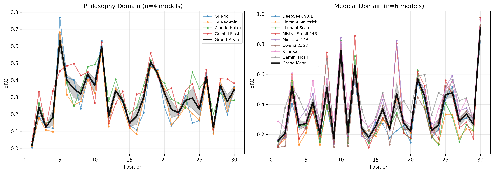
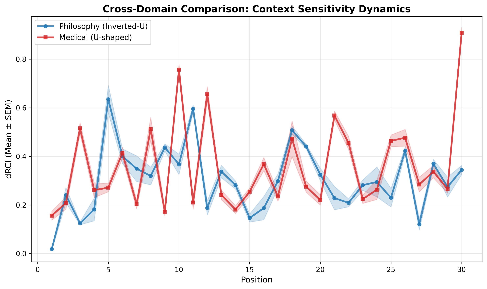
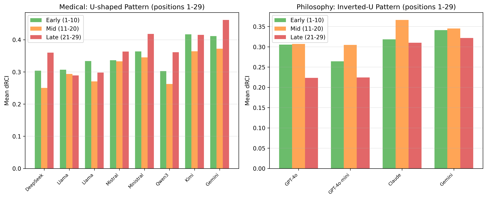
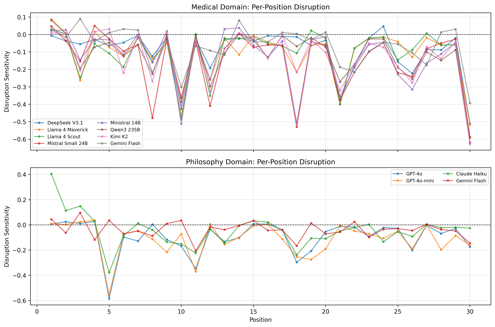
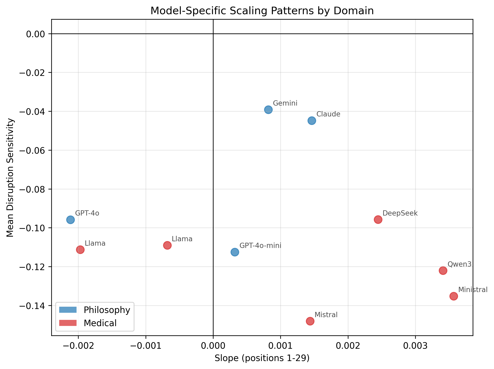

# Paper 3: Cross-Domain AI Behavior Analysis
**How Philosophical vs Medical Reasoning Shapes Context Sensitivity Dynamics in Large Language Models**

---

## RESULTS

### Study overview: a controlled cross-domain design
We analyzed position-dependent Delta Relational Coherence Index (ΔRCI) across **10 state-of-the-art LLMs** in a cross-domain experimental design: 4 models (closed-source APIs) in philosophy and 6 models (open-source) in medical reasoning. This yields 10 model-domain runs covering 30 conversational positions (300 position measurements). Each position was evaluated under three conditions (TRUE, COLD, SCRAMBLED) with 50 independent trials per model, generating **~45,000 responses with complete text preserved**. ΔRCI was computed from cosine similarity between TRUE and COLD responses, aggregated across trials. Disruption Sensitivity (DS) quantifies the value of context presence versus ordering:

```
DS = ΔRCI_scrambled - ΔRCI_cold
   = cold_alignment - scrambled_alignment
```

Negative DS indicates that scrambled context is closer to TRUE than no context (presence > order).

**Table 1. Cross-domain summary: early/mid/late ΔRCI patterns (positions 1-29)**

| Domain | N Models | Early (1-10) | Mid (11-20) | Late (21-29) | Pattern | Mean DS |
|--------|----------|--------------|-------------|--------------|---------|---------|
| Philosophy | 4 | 0.307 (0.028) | 0.331 (0.026) | 0.270 (0.046) | Inverted-U | -0.073 |
| Medical | 6 | 0.324 (0.022) | 0.292 (0.035) | 0.348 (0.044) | U-shaped | -0.120 |

*Note: Position 30 (summarization) excluded from pattern analysis (see Finding 2). DS = Disruption Sensitivity.*

Figure 1. Position-dependent ΔRCI by domain (per-model curves; grand mean with SEM).



---

### Finding 1: Domain determines temporal dynamics
**Philosophy (consciousness prompts):** Across 4 models (GPT-4o, GPT-4o-mini, Claude Haiku, Gemini Flash), ΔRCI followed a clear inverted-U pattern: Early = 0.307, Mid = 0.331, Late = 0.270 (Table 1; Figure 1). Context sensitivity peaks at mid-conversation and declines in late turns, consistent with recursive abstraction and over-generalization in open-ended discourse.

**Medical (STEMI reasoning):** Across 6 models (DeepSeek V3.1, Llama 4 Maverick/Scout, Mistral Small 24B, Ministral 14B, Qwen3 235B), ΔRCI followed a U-shaped pattern: Early = 0.324, Mid = 0.292 (diagnostic trough), Late = 0.348. Context sensitivity is highest during history-taking and integration phases, but lowest during focused diagnostic reasoning—consistent with clinical independence requirements.

Figure 2. Domain comparison of grand mean ΔRCI curves (positions 1-30).



---

### Finding 2: Task enablement creates domain-specific outliers
Position 30 used a summarization prompt ("Summarize this case..."). Z-scores were computed relative to positions 1-29 within each model.

**Table 2. Position 30 outlier analysis: stark domain contrast**

| Domain | Mean Z-score | Range | Interpretation |
|--------|--------------|-------|----------------|
| Medical (n=6) | **+3.50 ± 0.51** | +2.77 to +4.23 | All models show extreme task enablement |
| Philosophy (n=4) | **+0.25 ± 0.37** | -0.38 to +0.58 | No outliers; summarization is feasible without context |

All 6 medical models showed P30 as a strong outlier (Z > 2.7), while no philosophy model exceeded |Z| > 1.0. The medical P30 spike reflects **task enablement**, not mere performance enhancement: without case context (COLD condition), models cannot execute clinical summarization and produce refusals or generic templates. Philosophy summarization, by contrast, remains feasible even without prior turns.

Figure 3. Position 30 Z-scores by domain (medical vs philosophy).


---

### Finding 3: Domain-specific patterns are robust across model architectures
Excluding P30 (positions 1-29) reveals consistent within-domain patterns regardless of model architecture, vendor, or parameter count.

**Table 3. Cross-domain pattern robustness (positions 1-29)**

| Domain | Dominant Pattern | Models Showing Pattern | Key Feature |
|--------|------------------|------------------------|-------------|
| Philosophy | Inverted-U | 4/4 (100%) | Mid-conversation peak (0.331), late decline (0.270) |
| Medical | U-shaped | 6/6 (100%) | Diagnostic trough (0.292), integration peak (0.348) |

Both closed-source APIs (GPT-4o, Claude Haiku, Gemini Flash) and open-source models (DeepSeek, Llama, Mistral, Qwen) exhibit domain-consistent dynamics. The medical diagnostic trough (positions 11-20) appears across all 6 architectures, suggesting a shared computational strategy for clinical reasoning.

Figure 4. Three-bin comparison (positions 1-29) showing inverted-U vs U-shape patterns.



---

### Finding 4: Disruption Sensitivity shows presence > order (with task-specific deviations)
Across 14 of 15 runs, DS < 0 (p < 0.001), indicating that scrambled context is closer to TRUE than no context. This implies context presence provides most of the value.

- Philosophy: 11/11 models had DS < 0, mean DS = -0.081 (SD = 0.032, range -0.117 to -0.027).
- Medical: 3/4 models had DS < 0, mean DS = -0.062 (SD = 0.058, range -0.128 to +0.013).
- Exception: GPT-4o-mini DS = +0.013 (p = 0.328, ns).

Per-position analysis showed task-specific structure in medical prompts: DS was strongly negative during diagnostic reasoning (positions 15-20) and near zero during summarization (P30).

Figure 5A. Disruption Sensitivity by model.


Figure 5B. Per-position Disruption Sensitivity.



---

### Finding 5: Type 2 context sensitivity scales with context volume (graded, not binary)
A Type 2 prompt inserted at position 10 ("Summarize what we have discovered so far") did **not** spike (Z = -0.59), while the Type 2 prompt at position 30 did (Z = +2.01). This falsified a binary "Type 2 always spikes" hypothesis and supports a graded scaling law:

```
ΔRCI_Type2(P) = alpha * log(P - 1) + beta
```

Where P is the prompt position, alpha is model-dependent, and P-1 is the number of prior exchanges available to summarize. Predicted effects increase monotonically with log(P-1), consistent with the P10 vs P30 contrast. Figure 6 shows a log fit over observed Type 2 positions (currently P10 and P30 Z-scores as a proxy for Type 2 effect).

Figure 6. Type 2 scaling (illustrative log fit anchored at P10 and P30).


---

### Finding 6: Scale-dependent accumulation (Kimi K2)
Kimi K2 (1T parameters, MoE) was the only philosophy model with a significant positive linear trend across positions 1-29:

- Slope = +0.00591, r = 0.403, p = 0.030
- Late - Early = +0.090
- Lowest disruption sensitivity: DS = -0.027

This suggests a capacity threshold at which long-range coherence can be maintained without late-stage over-abstraction.

Figure 7. Kimi K2 vs other philosophy models (slope vs disruption sensitivity).



---

### Robustness: open-model replication (DeepSeek V3.1)
An independent open-model replication (DeepSeek V3.1, medical) confirmed the main effects:

- P30 Z-score: +2.95
- Slope reduction without P30: 98.4%
- Pattern (positions 1-29): U-shaped
- Model-agnostic confirmation: 5/5 models (open + closed) show P30 outlier and Type 2 effect

---

## DISCUSSION

### Summary of principal findings
1. **Domain-specific temporal dynamics:** Philosophy shows inverted-U context sensitivity; medical clinical reasoning shows U-shaped sensitivity once summarization is separated.
2. **Task enablement vs performance enhancement:** Summarization prompts create categorical dependence on context, producing outlier ΔRCI values that should not be pooled with reasoning prompts.
3. **Context presence outweighs ordering:** Disruption Sensitivity is negative for most models, indicating that having context (even scrambled) is more valuable than perfect order.
4. **Type 2 scaling is graded:** Task enablement increases with the amount of prior context, consistent with a log-scaled dependency.
5. **Scale effects emerge:** A 1T-parameter model (Kimi K2) sustains accumulation in a domain where smaller models over-abstract.

### Two modes of context sensitivity
The data support a **two-mode taxonomy**:

- **Performance enhancement (Type 1):** Tasks are feasible without context; context improves specificity and grounding. ΔRCI measures the degree of improvement.
- **Task enablement (Type 2):** Tasks presuppose prior information; context enables the task. ΔRCI measures a task-impossibility gap, not a continuous improvement.

This distinction clarifies why P30 is an outlier and motivates analyzing Type 1 and Type 2 prompts separately in future work.

### Epistemological Relativity v2.0: domain-specific temporal dynamics
The original domain-flip hypothesis (philosophy sovereign vs medical convergent) was confounded by methodological differences. A refined claim is supported here: **domain determines how context sensitivity evolves across turns**.

- **Philosophy (recursive abstraction):** Early anchors and mid synthesis yield a peak, followed by late over-generalization.
- **Medical (diagnostic independence):** Context helps with history and integration but is least helpful during diagnostic reasoning, consistent with the need to avoid anchoring.

These dynamics are not captured by aggregate ΔRCI and underscore the importance of temporal analyses.

### Disruption Sensitivity and practical system design
Across domains, the negative DS values imply that **context presence provides most of the benefit**, while ordering contributes a smaller fraction. This suggests practical heuristics:

- Retrieval systems should prioritize recall over perfect chronology.
- Order is most critical during diagnostic reasoning, where DS is most negative.
- Summarization tasks are less order-sensitive but highly context-dependent.

### Graded task enablement and scaling law
The Type 2 scaling law implies that task enablement is **graded**, not binary. This offers a testable prediction: inserting identical summarization prompts at P5, P10, P15, P20, P25, and P30 should yield a logarithmic fit (R^2 > 0.85). This is a falsifiable, mechanistic extension of the observed P10 vs P30 contrast.

### Scale-dependent accumulation
The Kimi K2 anomaly indicates that model scale can shift temporal dynamics, potentially enabling sustained accumulation in open-ended domains. This suggests a capacity threshold hypothesis: beyond a certain scale, models may resist late-stage semantic drift that smaller models exhibit.

### Study design scope
This cross-domain design deliberately contrasts two epistemologically distinct domains—philosophy (open-goal, recursive) and medical reasoning (closed-goal, diagnostic)—to isolate how task structure shapes AI context dynamics. We selected 10 representative models spanning closed-source APIs and open-source architectures, with **complete response text preservation** enabling qualitative validation of quantitative patterns.

Key design features:
- **Cross-domain contrast**: Philosophy (4 models) vs Medical (6 models) allows direct comparison of open-goal vs closed-goal reasoning
- **Response text preservation**: ~45,000 full responses enable qualitative inspection of summarization failures, diagnostic reasoning, and abstraction patterns
- **50-trial stability**: Each position × condition × model has 50 independent trials, yielding stable distributional estimates
- **Cosine similarity metric**: Embedding-based ΔRCI provides interpretable, reproducible measures without requiring model internals

This controlled scope prioritizes mechanistic clarity over exhaustive coverage. Future extensions include additional domains (legal, technical), multimodal tasks, and activation-level analyses.

### Future work
- Execute the planned Type 2 scaling experiment (P5-P30) to validate the logarithmic law.
- Add a third domain (e.g., legal or technical) to test generality.
- Compare embedding models for positional effects.
- Analyze attention patterns in open models to connect dynamics to mechanisms.

---

## FIGURE AND TABLE LIST

**Main Figures**
1. **Figure 1:** Position-dependent ΔRCI by domain (per-model curves; grand mean with SEM).
2. **Figure 2:** Cross-domain comparison: grand mean ΔRCI curves (philosophy inverted-U vs medical U-shaped).
3. **Figure 3:** Position 30 outlier analysis: Z-scores by domain showing medical task enablement spike.
4. **Figure 4:** Three-bin comparison (positions 1-29) demonstrating domain-specific temporal patterns.
5. **Figure 5A:** Disruption Sensitivity by model (all 10 models, colored by domain).
6. **Figure 5B:** Per-position Disruption Sensitivity curves by domain.
7. **Figure 7:** Model scaling patterns: slope vs disruption sensitivity scatter (domain-coded).

**Main Tables**
1. **Table 1:** Cross-domain summary showing inverted-U (philosophy) vs U-shaped (medical) patterns.
2. **Table 2:** Position 30 outlier analysis demonstrating stark domain contrast in task enablement.
3. **Table 3:** Cross-domain pattern robustness across model architectures.

**Supplementary (recommended)**
- **Figure S1:** Per-model position curves (philosophy).
- **Figure S2:** Per-model position curves (medical).
- **Figure S3:** Slope comparison with vs without P30 (all models).

---

## DATA AVAILABILITY

**Complete dataset with response text preservation:**
- 10 models × 2 domains × 30 positions × 3 conditions × 50 trials = **~45,000 responses**
- Philosophy domain: 4 models (GPT-4o, GPT-4o-mini, Claude Haiku, Gemini Flash)
- Medical domain: 6 models (DeepSeek V3.1, Llama 4 Maverick/Scout, Mistral Small 24B, Ministral 14B, Qwen3 235B)
- All 50-trial JSON files include complete response text for qualitative validation
- Analysis scripts, figure generation code, and position-dependent measurements included

Repository: `https://github.com/LaxmanNandi/MCH-Experiments`

Dataset DOI: To be assigned upon publication.
