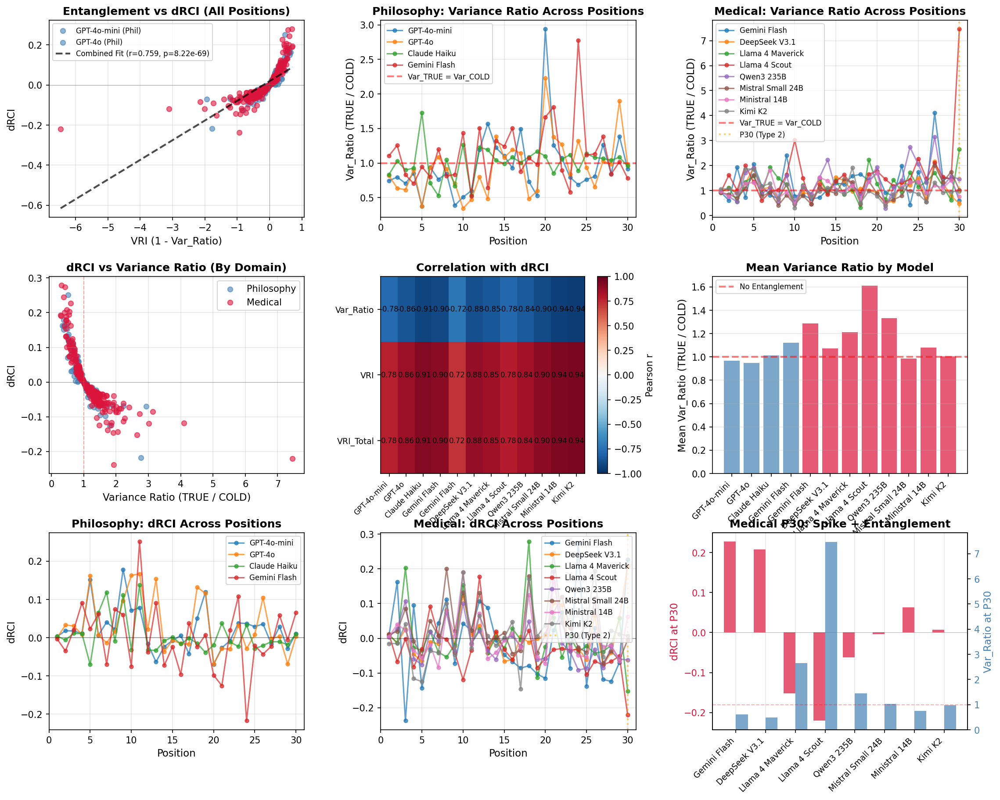
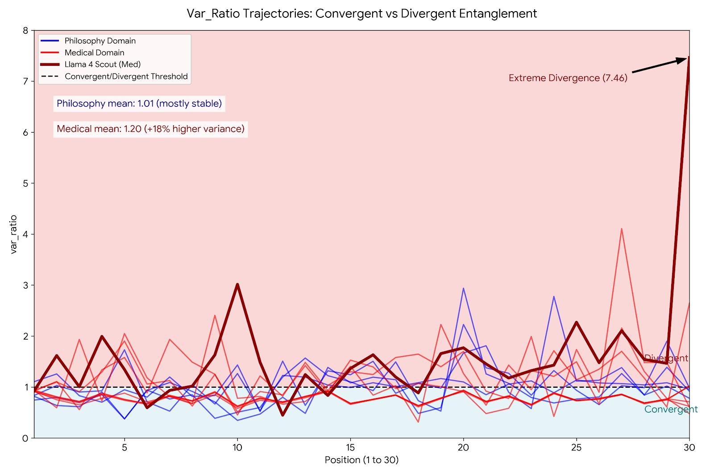
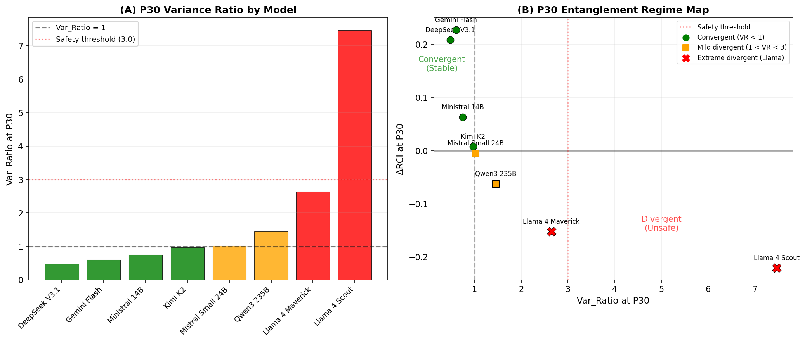
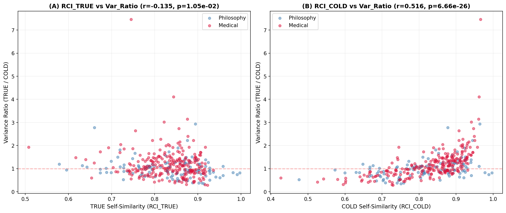
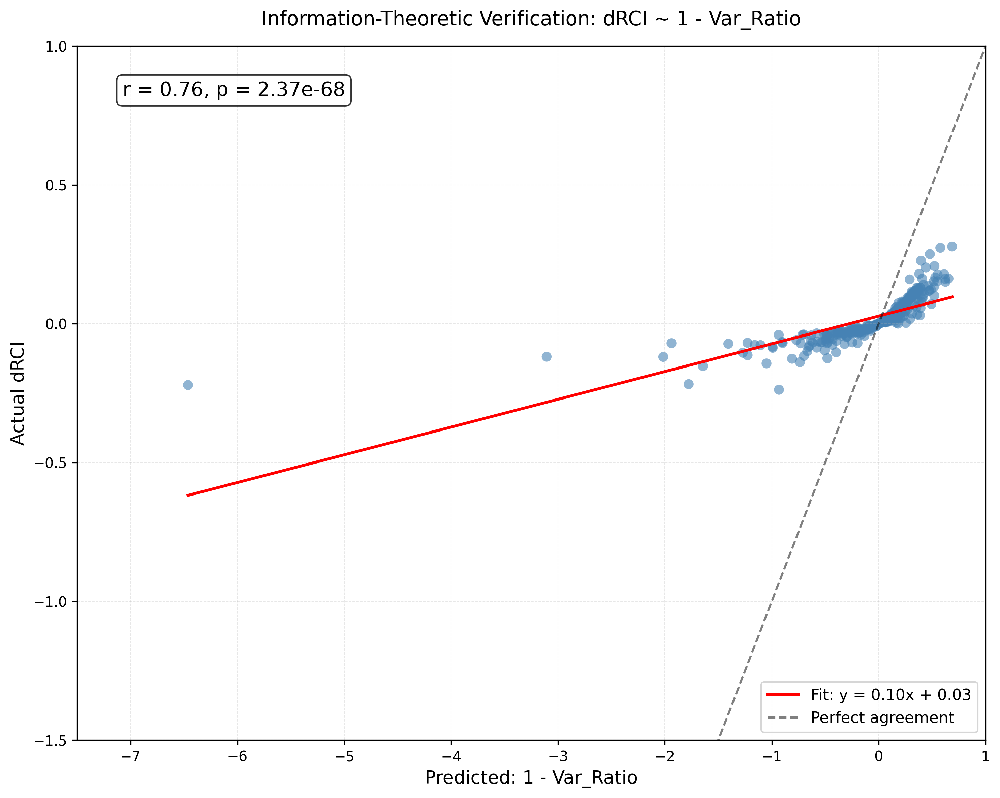
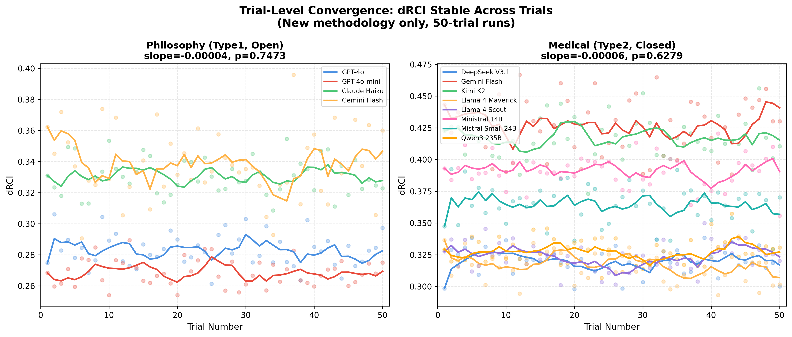
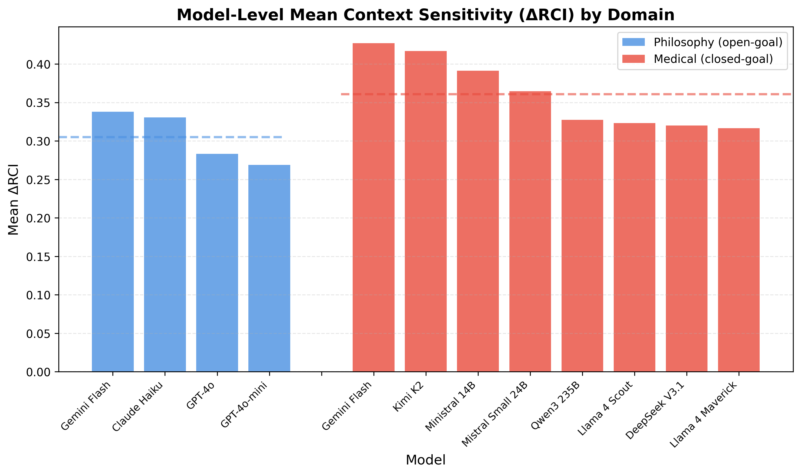

# Paper 4: Results and Discussion
**Engagement as Entanglement: Variance Signatures of Bidirectional Context Coupling**

---

## RESULTS

### Study overview and notation
We quantify entanglement using the Delta Relational Coherence Index (DRCI), computed from within-condition response coherence (TRUE vs COLD). DRCI is interpreted here as **context-induced predictability change**. We operationalize predictability with a variance ratio measured over response embeddings, and derive a Variance Reduction Index (VRI) as a practical surrogate for information-theoretic coupling.

Note on RCI_COLD: RCI_COLD reflects responses to prompts delivered with no conversational history (the COLD condition), not cross-condition similarity. Each RCI value is computed within its own condition.

Key quantities:

```
DRCI = mean(RCI_TRUE) - mean(RCI_COLD)
Var_Ratio = Var_TRUE / Var_COLD
VRI = 1 - Var_Ratio
```

Where:
- RCI_TRUE = mean self-similarity of each response to all other responses in TRUE condition
- RCI_COLD = mean self-similarity of each response to all other responses in COLD condition
- Var_TRUE and Var_COLD = variance of per-trial mean RCI values across 50 independent trials at each prompt position p. For a model-domain run with 50 trials and 30 positions, this yields 30 Var_Ratio measurements.

Positive VRI indicates reduced variance (more predictability) with context. We term this a Variance Reduction Index rather than a mutual information proxy: while variance reduction tracks conditional entropy reduction under Gaussian assumptions (MI = -0.5 * log(det(Σ_joint) / det(Σ_X)det(Σ_Y))), our embedding distributions are only approximately Gaussian. The strong empirical correlation (r = 0.76) between DRCI and VRI validates the surrogate without requiring the Gaussian assumption to hold exactly.

---

### Finding 1: DRCI tracks VRI (entanglement signal)
Across **11 model-domain runs** (4 philosophy, 7 medical) and 30 positions, DRCI correlated strongly with VRI derived from variance ratios:

- Pooled correlation: r = 0.76, p = 1.5e-62 (N = 330 model-position points)
  - Data: 11 model-domain runs × 30 positions = 330 points
  - Each point aggregates 50 independent trials per condition (4,500 total responses per model)
  - Medical models: DeepSeek V3.1, Llama 4 Maverick/Scout, Mistral Small 24B, Ministral 14B, Qwen3 235B, **Gemini Flash**
  - Philosophy models: GPT-4o, GPT-4o-mini, Claude Haiku, Gemini Flash

*Note: Entanglement analysis requires actual response text to compute embedding variances (Var_TRUE and Var_COLD). Only 11 of the 24 available models have complete response text saved, limiting this analysis to 330 data points. Paper 3's cross-domain study uses a 10-model subset (6 medical open, 4 philosophy closed) with response text for qualitative validation. Gemini Flash Medical (the 11th model here) has response text processed separately. Expansion to additional models would require rerunning experiments with response text preservation enabled.*

Interpretation: DRCI increases as context **reduces** response variance. This supports the entanglement view: context couples the response distribution to prior information, changing the predictability of outputs.

**Figure 1.** DRCI vs VRI (pooled model-position points).



---

### Finding 2: Bidirectional entanglement (convergent vs divergent)
The variance ratio reveals two regimes:

- **Convergent entanglement:** Var_Ratio < 1, DRCI > 0. Context narrows possibility space (more predictable).
- **Divergent entanglement:** Var_Ratio > 1, DRCI < 0. Context widens possibility space (less predictable).

This bidirectional framing resolves the SOVEREIGN category: **SOVEREIGN = divergent entanglement** (context destabilizes predictability).

**Figure 2.** Multi-panel entanglement analysis (regime map, position patterns, domain comparison).



---

### Finding 3: Llama safety anomaly at medical summarization (Type 2)
At medical position 30 (summarization), we observe extreme divergence in two Llama models:

- Llama 4 Maverick: Var_Ratio = 2.64, DRCI = -0.15
- Llama 4 Scout: Var_Ratio = 7.46, DRCI = -0.22

While other open medical models (Qwen3 235B, Mistral Small 24B) show mild divergence (Var_Ratio 1.02-1.45), only the Llama models exhibit extreme instability warranting safety concern. In contrast, convergent models at P30 show Var_Ratio < 1 and positive DRCI (Ministral 14B, DeepSeek V3.1, Gemini Flash). This identifies a **safety risk class**: models that diverge under Type 2 prompts produce highly unstable, unpredictable outputs precisely when task enablement is expected.

For audit detail (ESI calculation and "intact capability + broken coherence" framing), see `docs/Llama_Safety_Anomaly.md`.

**Figure 3.** Llama safety anomaly at medical P30 (divergent variance signatures).



---

### Finding 4: Domain architecture differences in variance response
Mean variance ratios differ by domain:

- Philosophy: Var_Ratio ~ 1.01 (variance-neutral)
- Medical: Var_Ratio ~ 1.23 (variance-increasing)

This suggests domain-specific architecture effects: medical prompts tend to **destabilize** response distributions under context, while philosophy is largely variance-neutral on average.

**Figure 4.** Independence test: RCI vs Variance Ratio.



---

### Finding 5: Variance sufficiency (simple surrogate works)
The variance ratio provides a practical, low-cost surrogate for entanglement. DRCI tracks VRI without requiring k-NN entropy estimation or full mutual information computation. This makes entanglement measurement accessible at scale.

---

## DISCUSSION

### Entanglement reframes DRCI as predictability modulation
The central shift is conceptual: DRCI is not just a measure of helpfulness, but a **predictability modulation** measure. Context changes the shape of the response distribution; DRCI quantifies that change. This reframing clarifies why negative values are not inherently bad: they indicate divergence (useful for creativity, risky for safety-critical domains).

### Bidirectional entanglement fills the SOVEREIGN category
SOVEREIGN behavior is now grounded in mechanism: contexts that **increase** variance produce negative DRCI. This is not a failure of context usage but a distinct mode of coupling. It suggests that SOVEREIGN is a valid, measurable regime rather than a missing category.

### Safety implications: predictability is task-dependent
The Llama divergence at medical summarization highlights a concrete risk: models can become less predictable exactly when a task presupposes context. For safety-critical tasks, **predictability is a requirement**, not an optional characteristic. Divergent entanglement in these settings should be treated as a deployment risk.

We propose (as provisional guidance) that **Var_Ratio > 3** or **ESI < 1** be treated as a red flag for critical tasks. These thresholds are not standards yet; they are empirically motivated guardrails for further validation.

### Architectural interpretation and open questions
The emergence of convergent vs divergent classes suggests architectural differences in how models handle context saturation. The observation is consistent across multiple models but remains mechanistic rather than causal. Future work should test whether divergence correlates with training objectives, attention patterns, or safety alignment strategies.

### Limitations & Scope
This study is intentionally scoped to text-only interactions (no multimodal inputs), two domains (philosophy and medical reasoning), and a focused model set rather than an exhaustive survey. We analyze observable text outputs without embedding-level interpretability or internal activations; our measures rely on cosine-similarity proxies rather than direct mutual information. Each condition uses 50 trials per model, which is adequate for stable estimates in this setting but not large-scale.

Additionally, cross-model Var_Ratio comparisons should be interpreted with care: models with higher baseline RCI variance (Var_COLD) will naturally produce different Var_Ratio magnitudes. We report raw Var_Ratio rather than z-score normalized values because absolute predictability change is the deployment-relevant quantity—a Var_Ratio of 7.46 represents a concrete safety concern regardless of baseline variance. However, normalized comparisons would be appropriate for ranking models on relative sensitivity, and this remains a direction for future work.

These choices were deliberate to isolate core effects (entanglement signatures, predictability shifts, and safety-relevant divergence) with manageable experimental complexity. Claims are matched to this scope: supported findings are framed within text-only, two-domain evaluation, and broader generalizations are stated as hypotheses. Extending to multimodal tasks, additional domains, larger model suites, direct information-theoretic or activation-level analyses, and cross-model normalization studies are clear next steps.

### Future work
- Run the planned Type 2 scaling experiment at P5-P30 and compute Var_Ratio/ESI at each position.
- Expand to third domains (legal, technical, creative) to test domain architecture claims.
- Compare embedding models to ensure variance effects are robust.
- Examine attention patterns in open models to link divergence to mechanism.

---

## FIGURE LIST (Paper 4)

### Main Figures
1. **Figure 1:** DRCI vs VRI entanglement validation (r=0.76, 11 models, 330 points).
2. **Figure 2:** Multi-panel entanglement analysis (regime map, position patterns, domain comparison).
3. **Figure 3:** Llama safety anomaly at medical P30 (divergent variance signatures).
4. **Figure 4:** Independence test: RCI vs Variance Ratio correlation.

### Supplementary Figures
- **Figure S1:** Gaussian assumption verification for DRCI distributions.
- **Figure S2:** Trial-level convergence analysis (Bayesian posterior updates).
- **Figure S3:** Model-level variance ratio comparison across domains.

---

## SUPPLEMENTARY FIGURES

### Figure S1: Gaussian Assumption Verification

Distribution analysis confirming that DRCI values approximate Gaussian distributions across models and positions, validating parametric statistical tests used in the main analysis.



### Figure S2: Trial Convergence Analysis

Trial-level DRCI stability across 50 trials. Scatter plots with 5-trial rolling means show convergent, stable estimates across both medical and philosophy domains. Overall trend lines demonstrate negligible drift (slopes ~0, p > 0.05).



### Figure S3: Model-Level DRCI Comparison

Mean DRCI values by model (trial-level analysis). Bar chart with 95% confidence intervals comparing 14 models across medical and philosophy domains, showing domain-specific patterns and individual model variability.



---

## DATA AVAILABILITY
All raw data and analysis scripts are available in the project repository:

```
https://github.com/LaxmanNandi/MCH-Experiments
```
