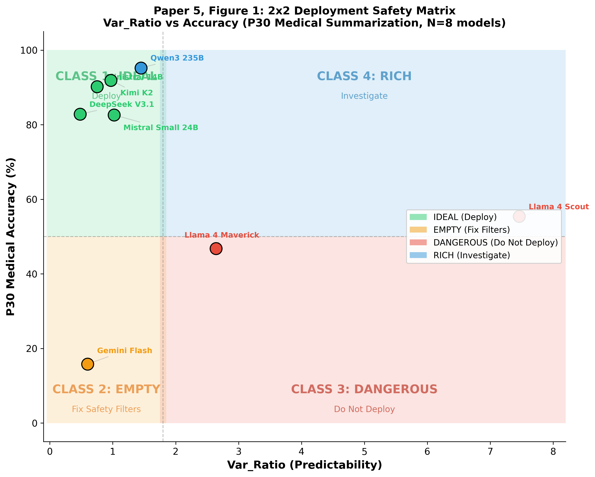
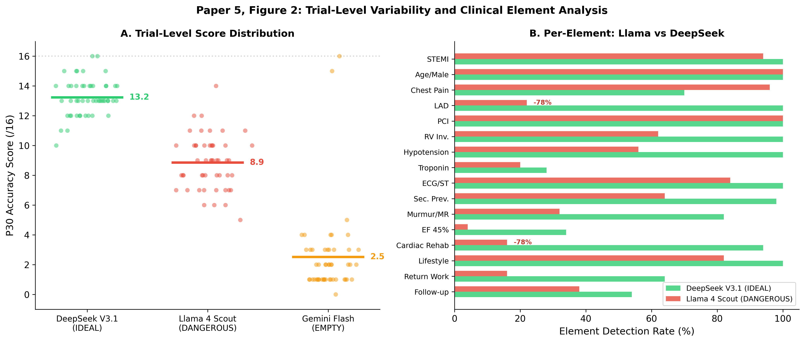
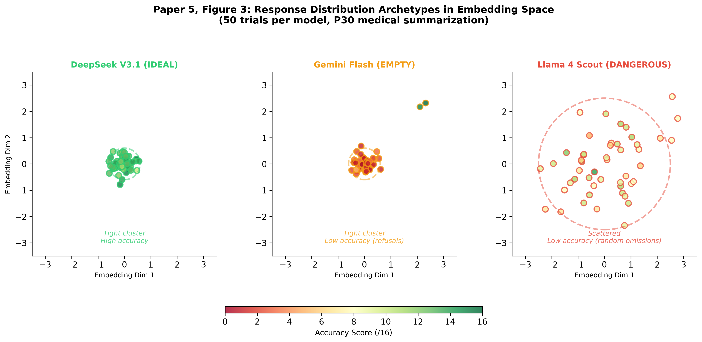
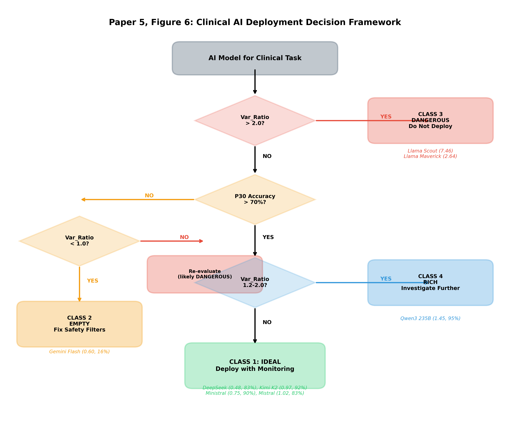

# Paper 5: Safety Taxonomy for Clinical AI Deployment
## Predictability as a Safety Metric: When Correct Isn't Safe

**Version:** 1.1
**Date:** February 14, 2026
**Status:** Defined
**Author:** Dr. Laxman M M, MBBS | Primary Health Centre Manchi, Karnataka

---

## Abstract

This document defines Paper 5 of the MCH Research Program, which extends the Variance Ratio Index (VRI) framework to clinical deployment decisions. Cross-model accuracy verification reveals that Var_Ratio alone does not predict task completeness—instead, a four-class behavioral taxonomy emerges that maps AI systems to distinct deployment recommendations. The framework provides a two-dimensional assessment (Var_Ratio × Accuracy) that detects failure modes invisible to standard accuracy benchmarks.

---

## 1. Background

### Research Program Context

| Paper | Question | Status |
|-------|----------|--------|
| Paper 1 | Does context matter? | Published |
| Paper 2 | How does it vary? | Published |
| Paper 3 | What patterns exist? | Draft complete |
| Paper 4 | Why does it happen? | Draft complete |
| **Paper 5** | **How do we deploy safely?** | **Defined** |

### Motivation

Paper 4 identified the Llama anomaly (Var_Ratio = 7.46 at P30 Medical). This paper extends that finding by:
1. Verifying medical accuracy across all models with response text
2. Testing the hypothesis that Var_Ratio predicts task completeness
3. Developing a deployment framework based on findings

---

## 2. Methods

### Experimental Parameters (Identical Across Models)

| Parameter | Value |
|-----------|-------|
| Temperature | 0.7 |
| Max tokens | 1024 |
| Trials per model | 50 |
| Prompt | P30 Medical ("Summarize this case...") |
| Context | 29-exchange STEMI case history |
| Embedding | all-MiniLM-L6-v2 (384-dimensional) |

### Accuracy Rubric

16-element clinical scoring rubric spanning the full case trajectory:

| Phase | Elements |
|-------|----------|
| Presentation (P1–P5) | Chest pain, age 52 male, STEMI diagnosis |
| Diagnostics (P6–P10) | Troponin elevated, EF 45%, LAD occlusion |
| Intervention (P11–P15) | PCI performed, RV involvement, hypotension management |
| Complications (P16–P20) | New murmur, mitral regurgitation (day 2) |
| Recovery (P21–P29) | Cardiac rehab, return to work, follow-up plan |

---

## 3. Results

### 3.1 Cross-Model Accuracy

| Model | Var_Ratio | Mean Acc (raw) | Mean Acc (%) | Std | Range | Perfect Scores |
|-------|-----------|----------------|-------------|-----|-------|----------------|
| DeepSeek V3.1 | 0.48 | 13.2/16 | 82.8% | 1.23 | 10–16 | 2/50 |
| Gemini Flash | 0.60 | 2.5/16 | 15.8% | 2.88 | 0–16 | 1/50 |
| Ministral 14B | 0.75 | 14.4/16 | 90.2% | 1.71 | 7–16 | 10/50 |
| Kimi K2 | 0.97 | 14.7/16 | 91.9% | 1.04 | 11–16 | 13/50 |
| Mistral Small 24B | 1.02 | 13.2/16 | 82.6% | 1.25 | 10–16 | 1/50 |
| Qwen3 235B | 1.45 | 15.2/16 | 95.2% | 0.86 | 13–16 | 23/50 |
| Llama 4 Maverick | 2.64 | 7.5/16 | 46.8% | 1.33 | 5–11 | 0/50 |
| Llama 4 Scout | 7.46 | 8.9/16 | 55.4% | 1.78 | 5–14 | 0/50 |

### 3.2 Correlation Analysis

| Correlation | Pearson r | p-value | Spearman ρ | p-value |
|-------------|-----------|---------|------------|---------|
| Var_Ratio vs Accuracy | −0.21 | 0.65 | 0.00 | 1.00 |
| Var_Ratio vs Std | −0.01 | 0.99 | −0.07 | 0.88 |
| Var_Ratio vs Range | −0.12 | 0.79 | −0.13 | 0.79 |

**Finding:** No significant linear or monotonic correlation between Var_Ratio and accuracy. The relationship is categorical, not continuous.


---

## 4. The 2×2 Deployment Matrix



```
                        ACCURACY
                    Low         High
                ┌───────────┬───────────┐
           Low  │  CLASS 2  │  CLASS 1  │
  Var_Ratio     │  (Empty)  │  (Ideal)  │
                ├───────────┼───────────┤
           High │  CLASS 3  │  CLASS 4  │
                │(Dangerous)│  (Rich)   │
                └───────────┴───────────┘
```

---

## 5. Four Behavioral Classes

### Class 1: IDEAL — Consistent and Comprehensive
| Attribute | Value |
|-----------|-------|
| Var_Ratio | < 1.2 |
| Accuracy | High (82–92%) |
| Models | DeepSeek V3.1, Ministral 14B, Kimi K2, Mistral Small 24B |
| Behavior | Low output variance with high task completeness |
| Recommendation | **Deploy with standard monitoring** |

### Class 2: EMPTY — Safety Filter Pathology
| Attribute | Value |
|-----------|-------|
| Var_Ratio | Low (0.60) |
| Accuracy | Low (15.8%) |
| Models | Gemini Flash |
| Behavior | Convergent toward empty or refused responses |
| Recommendation | **Reconfigure safety filters before deployment** |

### Class 3: DANGEROUS — Stochastic Completeness Failure
| Attribute | Value |
|-----------|-------|
| Var_Ratio | High (2.64–7.46) |
| ESI | Low (0.15–0.61) |
| Accuracy | Low–Medium (47–55%) |
| Models | Llama 4 Scout, Llama 4 Maverick |
| Behavior | Unpredictable output variance with incomplete task coverage |
| Recommendation | **Do not deploy in clinical settings** |

### Class 4: RICH — Under Investigation
| Attribute | Value |
|-----------|-------|
| Var_Ratio | Moderate (1.2–2.0) |
| Accuracy | High (95.2%) |
| Models | Qwen3 235B |
| Behavior | Diverse surface forms with consistent semantic accuracy |
| Recommendation | **Investigate further; potential beneficial divergence** |

---

## 6. Var_Ratio Continuous Scale and Entanglement Safety Index


### Var_Ratio Thresholds

| Range | Classification | Interpretation |
|-------|----------------|----------------|
| < 0.8 | Overly rigid | Risk of empty convergence (Class 2) |
| 0.8–1.2 | Ideal | Stable and complete (Class 1) |
| 1.2–2.0 | Rich divergence | Potentially beneficial variation (Class 4) |
| > 2.0 | Dangerous | Coherence breakdown risk (Class 3) |

### Entanglement Safety Index (ESI)

ESI provides an interpretable safety metric derived from Var_Ratio (introduced in Paper 4):

```
ESI = 1 / |1 − Var_Ratio|
```

| ESI Range | Interpretation |
|-----------|----------------|
| ESI > 2.0 | Strongly convergent; stable under context |
| ESI ≈ 1.0 | Near variance-neutral |
| ESI < 1.0 | Divergent; context destabilizes outputs |
| ESI < 0.2 | Extreme instability; safety concern |

### P30 Medical ESI Values

| Model | Var_Ratio | ESI | Accuracy | Class |
|-------|-----------|-----|----------|-------|
| DeepSeek V3.1 | 0.48 | 1.91 | 82.8% | IDEAL |
| Gemini Flash | 0.60 | 2.52 | 15.8% | EMPTY |
| Kimi K2 | 0.97 | 33.3 | 91.9% | IDEAL |
| Llama 4 Maverick | 2.64 | 0.61 | 46.8% | DANGEROUS |
| Llama 4 Scout | 7.46 | 0.15 | 55.4% | DANGEROUS |

ESI correctly identifies Class 3 (DANGEROUS) models (ESI < 1) and Class 1 (IDEAL) models (ESI > 1). However, Class 2 (EMPTY) Gemini Flash has high ESI (2.52) despite low accuracy, demonstrating that ESI alone is insufficient—both dimensions are required for safe classification.

**Cross-reference:** See Paper 4, Figure 7 for the Var_Ratio/ESI divergence visualization across all 11 models.

---

## 7. The Llama Anomaly: Detailed Analysis



### Element-Level Accuracy

**Consistently present (core facts):**

| Element | Llama Scout | Llama Maverick |
|---------|-------------|----------------|
| STEMI diagnosis | 94% | 100% |
| PCI performed | 100% | 100% |
| Age 52 male | 100% | 100% |
| Chest pain | 96% | 58% |

**Stochastically omitted (critical details):**

| Element | Llama Scout | Llama Maverick | DeepSeek V3.1 |
|---------|-------------|----------------|---------------|
| LAD occlusion | 22% | 6% | 100% |
| EF 45% | 4% | 2% | 34% |
| Cardiac rehab | 16% | 22% | 94% |
| Return to work | 16% | 0% | 64% |
| Follow-up plan | 38% | 34% | 54% |

### Key Observations

- Zero hallucinations detected across 100 Llama trials (50 Scout + 50 Maverick)
- All errors are omissions, not fabrications
- Identical case and prompt: Scout Trial 27 captures 5/16 elements; Trial 11 captures 13/16
- COLD condition baselines: Scout 1.0/16, Maverick 1.1/16

### Characterization

> Llama produces summaries that are factually sound but randomly incomplete—critical case details are included or omitted stochastically across trials. This is clinically dangerous: a physician relying on such a summary would receive an accurate but arbitrarily partial picture, with no indication that information is missing.



---

## 8. Methodological Considerations

### Controlled experimental conditions
All models operated under identical constraints (max_tokens: 1024, temperature: 0.7, identical prompt and context). Accuracy differences across models reflect architectural variation rather than infrastructural limits.

### Insufficiency of accuracy as a sole metric
Standard accuracy benchmarks would rate Llama Scout's 55% as moderate but not disqualifying. The Var_Ratio dimension (7.46) captures extreme trial-to-trial inconsistency that accuracy metrics alone do not surface, motivating the two-dimensional framework.

### Semantic variance, not surface variance
Var_Ratio is computed from 384-dimensional sentence embeddings (all-MiniLM-L6-v2) that capture semantic content. Across Llama trials, different clinical elements are emphasized or omitted stochastically—this reflects semantic variance in information selection, not stylistic or formatting differences.

---

## 9. Supplementary Analysis: Continuous vs Categorical

We tested whether Var_Ratio exhibits a U-shaped (or inverted-U) relationship with perfect scores, as proposed by the hypothesis that moderate divergence (Var_Ratio 1.2–2.0) is optimal for summarization tasks.

### Quadratic Model Fit

| Analysis | Quadratic R² | F-test p | Significant? |
|----------|-------------|----------|--------------|
| Full dataset (N=8) | 0.11 | 0.72 | No |
| Excluding Gemini (N=7) | 0.14 | 0.89 | No |

The quadratic model is not significantly better than the linear model. The apparent peak (Qwen3 at VR=1.45, 23/50 perfect scores) is driven by a single data point; within-zone variance is large (e.g., Kimi K2: 13 perfect vs Mistral Small: 1 perfect at nearly identical Var_Ratios).

### Best Predictor of Perfect Scores

| Metric | Spearman ρ | p-value |
|--------|------------|---------|
| Mean accuracy | 0.89–0.99 | < 0.003 |
| Score std | −0.70 to −0.76 | 0.049–0.054 |
| Var_Ratio | −0.39 to −0.49 | n.s. |

### Interpretation

The four-class behavioral taxonomy captures the structure in the data more effectively than any continuous model. The relationship between Var_Ratio and task performance is **categorical, not continuous**: models cluster into distinct behavioral classes rather than following a smooth function. This validates the 2×2 deployment matrix as the appropriate framework.

---

## 10. Contributions

1. **Falsification of simple hypothesis:** Var_Ratio does not linearly predict task accuracy (r = −0.21, p = 0.65)
2. **Four-class behavioral taxonomy:** Empirically derived classification for deployment decisions
3. **2×2 deployment matrix:** Two-dimensional framework for clinical AI safety assessment
4. **Novel detection capability:** Only VRI identifies Class 3 (Dangerous) models—standard benchmarks miss this failure mode entirely
5. **Continuous risk stratification:** Var_Ratio thresholds and ESI for graded safety assessment



---

## 11. Proposed Paper Structure

| Section | Content |
|---------|---------|
| Introduction | Accuracy is necessary but not sufficient for clinical deployment |
| Methods | Cross-model accuracy verification protocol |
| Results | 2×2 matrix and four-class taxonomy |
| Safety Filter Pathology | Gemini Flash: convergence toward empty responses |
| Stochastic Completeness Failure | Llama anomaly: VRI detection of coherence breakdown |
| Rich Divergence Hypothesis | Qwen3: beneficial variation at moderate Var_Ratio |
| Deployment Framework | Quadrant-based recommendations with ESI validation |
| Discussion | Integration with MCH framework; limitations |
| Conclusion | Predictability as an independent safety dimension |

---

## 12. Integration with MCH Framework

### Dimensional Extension

| Dimension | Metric | Paper |
|-----------|--------|-------|
| Context sensitivity | ΔRCI | Papers 1–2 |
| Entanglement | Var_Ratio / VRI | Papers 3–4 |
| **Completeness** | **Task accuracy** | **Paper 5** |

### Research Program Arc

```
Paper 1: Existence proof (ΔRCI validated)
    ↓
Paper 2: Methodology (standardized benchmark, 25 runs, 112,500 responses)
    ↓
Paper 3: Architectures (Type 1 vs Type 2 cognitive profiles)
    ↓
Paper 4: Theory (information-theoretic grounding, VRI)
    ↓
Paper 5: Application (deployment safety framework)
```

---

## 13. Summary

| Finding | Implication |
|---------|-------------|
| No linear correlation (r = −0.21, p = 0.65) | Var_Ratio–accuracy relationship is categorical |
| Four behavioral classes emerge | Taxonomy replaces continuous model |
| Gemini Flash: convergent but empty | Low Var_Ratio ≠ safe |
| Llama: divergent and incomplete | Only VRI detects this failure mode |
| Qwen3: divergent but accurate | Moderate divergence may indicate richness |

**Core Contribution:**
> A two-dimensional framework (Var_Ratio × Accuracy) that classifies AI systems into four behavioral classes with distinct deployment recommendations, detecting failure modes invisible to standard accuracy benchmarks.

---

## References

1. Laxman, M. M. (2026). Context curves behavior: Measuring context sensitivity in large language models. *Preprints.org*. DOI: 10.20944/preprints202601.1881.v2
2. Laxman, M. M. (2026). Scaling context sensitivity: A standardized benchmark of ΔRCI across 25 model-domain runs. *Preprints.org*. DOI: 10.20944/preprints202602.1114.v2
3. Paper 3: Cross-domain temporal dynamics (in preparation)
4. Paper 4: Entanglement theory and VRI (in preparation)

---

## Appendix: Data and Figure Locations

| Resource | Location |
|----------|----------|
| Cross-model accuracy results | `data/paper5/accuracy_verification/` |
| Llama trial-level analysis | `data/paper5/llama_deep_dive/` |
| Paper 5 figures | `papers/paper5_safety/figures/` |
| Figure generation script | `scripts/generate_paper5_figures.py` |

---

**Document Version:** 1.1
**Last Updated:** February 14, 2026
