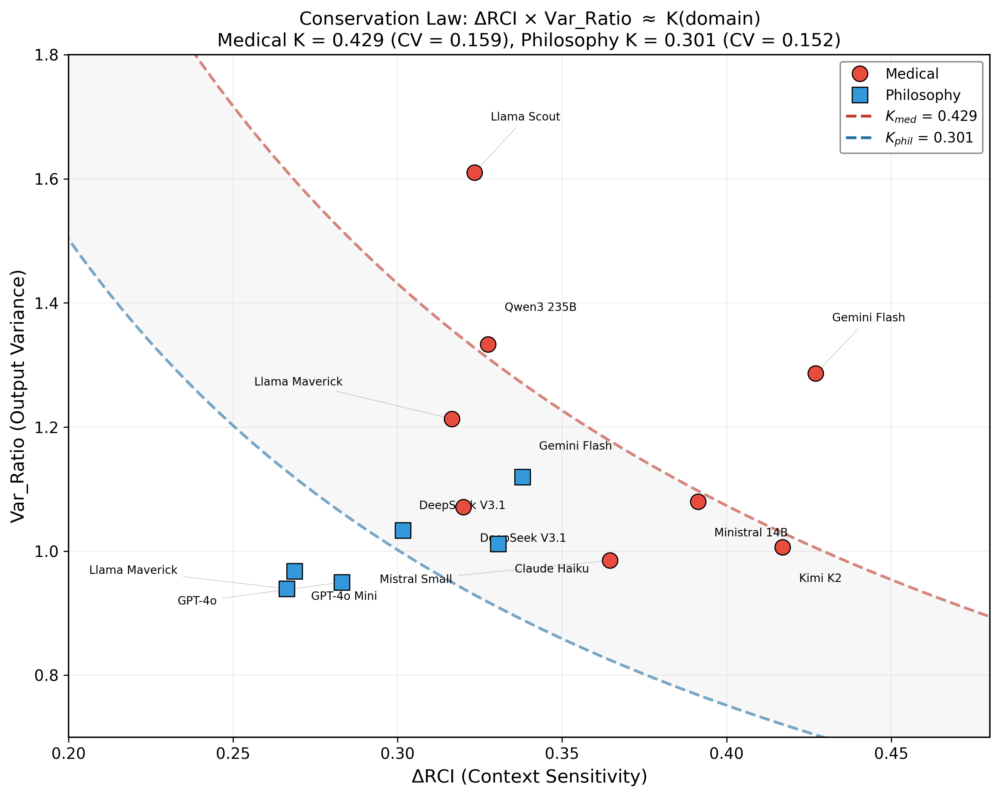
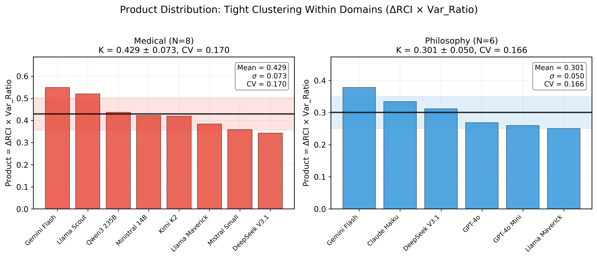
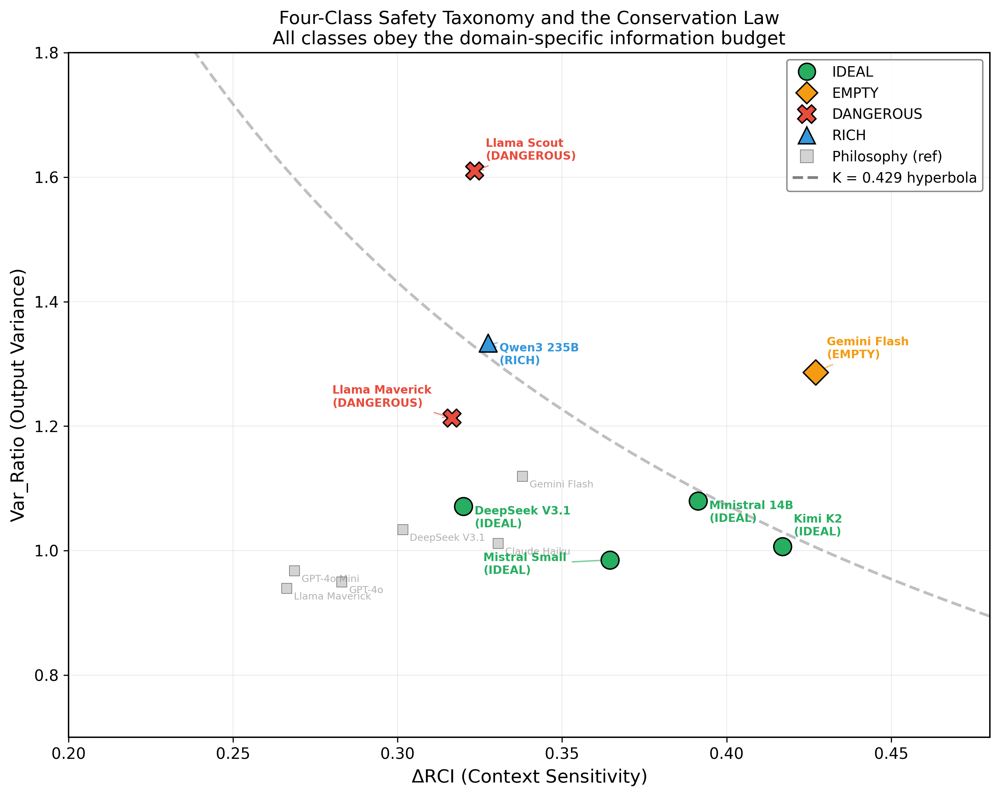

# An Empirical Conservation Constraint on Context Sensitivity and Output Variance: Evidence Across LLM Architectures

**Dr. Laxman M M, MBBS**
Government Duty Medical Officer, PHC Manchi, Karnataka, India
DNB General Medicine Resident (2026), KC General Hospital, Bangalore

---

## Abstract

We report an empirical conservation constraint governing the relationship between context sensitivity and output variance in large language models. Across 14 model-domain configurations spanning 11 architectures from 8 vendors, the product of context sensitivity (ΔRCI) and output variance (Var_Ratio) is approximately constant within a task domain: K(Medical) = 0.429 (CV = 0.170, N = 8) and K(Philosophy) = 0.301 (CV = 0.166, N = 6). These domain-specific scaling factors differ significantly (Mann-Whitney U = 46, p = 0.003; Cohen's d = 2.00). The constraint implies an inverse trade-off: architectures that exhibit greater context sensitivity tend to produce lower output variance, and vice versa, consistent with a shared capacity allocation shaped by task structure. This regularity holds across dense transformers, mixture-of-experts architectures, and both open- and closed-weight models, with parameter counts ranging from 14 billion to over 600 billion. We discuss this finding in terms of domain-specific resource allocation and identify testable predictions for additional domains. The constraint unifies prior observations on context sensitivity scaling (Papers 1-2), temporal dynamics (Paper 3), variance reduction (Paper 4), and deployment predictability (Paper 5) under a single quantitative relationship, and invites replication across broader task domains.

---

## 1. Introduction

The relationship between how a language model uses conversational context and how variable its outputs are across independent trials has remained empirically uncharacterized. Prior work in the MCH Research Program established that context sensitivity (ΔRCI) varies systematically across architectures (Papers 1-2), that output variance (Var_Ratio) captures entanglement dynamics (Paper 4), and that combining these dimensions with task accuracy yields a clinically relevant predictability taxonomy (Paper 5). However, whether ΔRCI and Var_Ratio are independent quantities or are linked by a deeper constraint has not been directly tested.

This paper reports such a constraint. We find that the product ΔRCI × Var_Ratio is approximately constant within a given task domain, across all tested architectures:

```
ΔRCI × Var_Ratio ≈ K(domain)
```

where K is a domain-specific scaling factor that differs between closed-goal (medical) and open-goal (philosophy) tasks. The relationship holds with a coefficient of variation at or below 0.17 within each domain, despite spanning architectures from 8 vendors with parameter counts ranging from 14B to 671B.

This regularity behaves like a conservation law in that a fixed quantity (the product) is preserved across diverse systems, but we emphasize that it is established empirically across two domains and 14 configurations. Whether it reflects a fundamental constraint on language model processing or an artifact of the specific task-embedding combination tested here remains an open question that requires broader replication.

The finding has three implications. First, it establishes that context sensitivity and output variance are not independent — they trade off against each other within a capacity determined by the task domain. Second, it provides a quantitative basis for the four-class predictability taxonomy introduced in Paper 5: the classes represent different allocation strategies within the same domain-specific capacity. Third, it suggests that task structure shapes the information-processing constraints under which language models operate more strongly than architectural differences do.

---

## 2. Background

### 2.1 Context Sensitivity (ΔRCI)

The Relative Context Index (RCI) measures the alignment between a model's responses under full conversational context (TRUE condition) and responses without context (COLD condition), computed as cosine similarity in a 384-dimensional sentence embedding space (all-MiniLM-L6-v2). ΔRCI is defined as the mean difference:

```
ΔRCI = mean(RCI_TRUE) - mean(RCI_COLD)
```

where RCI_TRUE = 1.0 (self-alignment) and RCI_COLD measures how closely context-free responses match context-dependent responses. Higher ΔRCI indicates greater context sensitivity — the model's responses diverge more from context-free baselines when conversational history is present. ΔRCI was introduced in Paper 1 and standardized across 14 models in Paper 2 (Laxman, 2026a, 2026b).

### 2.2 Output Variance (Var_Ratio)

Var_Ratio quantifies how conversational context shapes output variability, computed as the ratio of embedding variance across trials:

```
Var_Ratio = Var(TRUE embeddings) / Var(COLD embeddings)
```

where variance is computed across 50 independent trials at each conversational position. Var_Ratio > 1 indicates that context increases output variance relative to the context-free baseline (divergence); Var_Ratio < 1 indicates that context decreases variance (convergence). The Variance Reduction Index (VRI = 1 - Var_Ratio) was introduced in Paper 4 as the primary entanglement measure.

### 2.3 Four-Class Predictability Taxonomy

Paper 5 demonstrated that ΔRCI and Var_Ratio, when combined with task accuracy, yield a four-class behavioral taxonomy for deployment assessment:

| Class | Var_Ratio | Accuracy | Example | Characterization |
|-------|-----------|----------|---------|------------------|
| IDEAL | Low (< 1.2) | High | DeepSeek V3.1 | Convergent and accurate |
| EMPTY | Low (0.6) | Low (16%) | Gemini Flash | Convergent but incomplete |
| HIGH-VARIANCE | High (2.6-7.5) | Low-Medium | Llama Scout | Divergent and inconsistent |
| RICH | Moderate (1.5) | High (95%) | Qwen3 235B | Divergent but accurate |

The present paper tests whether these classes, and the underlying ΔRCI-Var_Ratio relationship, are governed by a conservation constraint.

### 2.4 Hypothesis

If context sensitivity and output variance draw on a shared processing capacity, their product should be approximately constant:

```
ΔRCI × Var_Ratio ≈ K
```

We test this hypothesis across 14 model-domain configurations.

---

## 3. Methods

### 3.1 Data

We analyze 14 model-domain runs from the MCH Research Program, each consisting of 50 independent trials under three conditions (TRUE, COLD, SCRAMBLED) with 30 conversational prompts per trial. All runs used identical experimental parameters: temperature = 0.7, max_tokens = 1024, embedding model = all-MiniLM-L6-v2 (384-dimensional).

**Medical domain** (8 runs): A 29-exchange STEMI case history followed by a summarization prompt (P30). Closed-goal task with a single correct answer structure.

**Philosophy domain** (6 runs): A 30-question progressive dialogue on consciousness, from definition through self-reference to meta-reflection. Open-goal task with no single correct answer.

### 3.2 Models

| Model | Vendor | Parameters | Runs |
|-------|--------|-----------|------|
| DeepSeek V3.1 | DeepSeek | 671B (37B active) | Med, Phil |
| Gemini Flash | Google | Undisclosed | Med, Phil |
| Llama 4 Scout | Meta | 17B-16E | Med |
| Llama 4 Maverick | Meta | 17B-128E | Med, Phil |
| Qwen3 235B | Alibaba | 235B (22B active) | Med |
| Mistral Small 24B | Mistral | 24B | Med |
| Ministral 14B | Mistral | 14B | Med |
| Kimi K2 | Moonshot | ~1T (MoE) | Med |
| Claude Haiku | Anthropic | Undisclosed | Phil |
| GPT-4o | OpenAI | Undisclosed | Phil |
| GPT-4o Mini | OpenAI | Undisclosed | Phil |

The sample spans dense transformers (Mistral Small 24B, Ministral 14B), mixture-of-experts architectures (DeepSeek V3.1, Qwen3, Llama 4, Kimi K2), and closed-weight models of undisclosed architecture (Gemini Flash, Claude Haiku, GPT-4o). Parameter counts range from 14B (Ministral) to approximately 1T (Kimi K2).

### 3.3 Metric Computation

**ΔRCI** was computed per trial as mean(RCI_TRUE) - mean(RCI_COLD), then averaged across 50 trials. Response embeddings were generated using all-MiniLM-L6-v2, consistent with Papers 1-5.

**Var_Ratio** was computed per conversational position as Var(TRUE embeddings across 50 trials) / Var(COLD embeddings across 50 trials), then averaged across all 30 positions. Variance was computed as the mean variance across all 384 embedding dimensions.

**Conservation Product** was computed as the simple product: Product = ΔRCI × Var_Ratio.

### 3.4 Statistical Analysis

Within-domain conservation was assessed by the coefficient of variation (CV = SD/mean, using sample standard deviation with Bessel's correction) of the product. We adopted the following thresholds:

- CV < 0.20: Constraint holds (tight clustering)
- CV 0.20-0.30: Weak constraint
- CV > 0.30: No constraint

Between-domain comparison used Mann-Whitney U (non-parametric, appropriate for small N) and Welch's t-test (for reference). Effect size was quantified by Cohen's d with pooled standard deviation.

### 3.5 Initial MI-Based Test

We initially tested a more specific theory proposing that the conservation constraint is mediated by mutual information (MI) between TRUE and COLD response distributions, with quantitative predictions ΔRCI = 1 - exp(-2·MI) and ΔRCI × Var_Ratio = 1 - 2·MI. MI was estimated using the KSG (Kraskov-Stögbauer-Grassberger) entropy estimator (k = 3) after PCA reduction to 20 components, with 1000-iteration bootstrap confidence intervals. This test yielded unreliable MI estimates (negative values for philosophy runs, indicating estimator failure in high-dimensional embedding space) and is reported in the supplementary analysis for transparency.

---

## 4. Results

### 4.1 Conservation Product Across Models

Table 1 presents the conservation product for all 14 model-domain runs, sorted by domain and product magnitude.

**Table 1.** Conservation product (ΔRCI × Var_Ratio) across 14 model-domain configurations.

| Model | Domain | ΔRCI | Var_Ratio | Product |
|-------|--------|------|-----------|---------|
| Gemini Flash | Medical | 0.427 | 1.287 | 0.549 |
| Llama 4 Scout | Medical | 0.323 | 1.610 | 0.521 |
| Qwen3 235B | Medical | 0.328 | 1.334 | 0.437 |
| Ministral 14B | Medical | 0.391 | 1.080 | 0.423 |
| Kimi K2 | Medical | 0.417 | 1.006 | 0.420 |
| Llama 4 Maverick | Medical | 0.316 | 1.213 | 0.384 |
| Mistral Small 24B | Medical | 0.365 | 0.985 | 0.359 |
| DeepSeek V3.1 | Medical | 0.320 | 1.071 | 0.343 |
| Gemini Flash | Philosophy | 0.338 | 1.120 | 0.378 |
| Claude Haiku | Philosophy | 0.331 | 1.012 | 0.334 |
| DeepSeek V3.1 | Philosophy | 0.302 | 1.034 | 0.312 |
| GPT-4o | Philosophy | 0.283 | 0.950 | 0.269 |
| GPT-4o Mini | Philosophy | 0.269 | 0.968 | 0.260 |
| Llama 4 Maverick | Philosophy | 0.266 | 0.939 | 0.250 |

### 4.2 Within-Domain Conservation

**Table 2.** Summary statistics for the conservation product by domain.

| Domain | N | Mean (K) | SD | CV | 95% CI | Min | Max |
|--------|---|----------|-----|-----|--------|-----|-----|
| Medical | 8 | 0.429 | 0.073 | 0.170 | [0.368, 0.490] | 0.343 | 0.549 |
| Philosophy | 6 | 0.301 | 0.050 | 0.166 | [0.248, 0.353] | 0.250 | 0.378 |

Both domains exhibit CV below 0.20, indicating that the product ΔRCI × Var_Ratio clusters tightly within each domain. This clustering persists despite substantial variation in the individual components: Medical ΔRCI ranges from 0.316 to 0.427 and Var_Ratio ranges from 0.985 to 1.610, yet the product remains within a narrow band (Figure 1).



*Figure 1.* Conservation constraint: ΔRCI × Var_Ratio ≈ K(domain). Each point represents one model-domain run. Dashed curves show the hyperbolas ΔRCI × Var_Ratio = K for each domain. Models cluster along their respective domain hyperbolas despite spanning 8 vendors and architectures from 14B to 671B parameters.

### 4.3 Between-Domain Difference

The domain-specific scaling factors differ significantly:

**Table 3.** Between-domain statistical tests.

| Test | Statistic | p-value |
|------|-----------|---------|
| Mann-Whitney U | U = 46.0 | p = 0.003 |
| Welch's t-test | t = 3.91 | p = 0.002 |
| Cohen's d | d = 2.00 | (very large) |

The medical domain has a 43% higher conservation product than the philosophy domain (K_med / K_phil = 1.43). This difference is consistent with the interpretation that closed-goal tasks (with convergent answer structures) yield a higher domain-specific scaling factor than open-goal tasks (Figure 3).



*Figure 2.* Distribution of the conservation product within each domain. Horizontal lines indicate domain means; shaded regions indicate ±1 SD. The tight clustering within domains (CV < 0.17) contrasts with the significant separation between domains (p = 0.003).


*Figure 3.* Domain-specific scaling factors with individual data points and 95% confidence intervals. The medical domain factor (K = 0.429) is significantly higher than the philosophy domain factor (K = 0.301).

### 4.4 Relationship to Predictability Taxonomy

The four-class predictability taxonomy from Paper 5 maps onto the conservation constraint. All classes follow the domain-specific hyperbola — they represent different strategies for allocating the same domain-specific capacity (Figure 4).

- **IDEAL** models (DeepSeek V3.1, Kimi K2, Ministral 14B, Mistral Small 24B) occupy the balanced region of the hyperbola, with moderate values of both ΔRCI and Var_Ratio.
- **EMPTY** (Gemini Flash Medical) sits at high ΔRCI with high Var_Ratio — the model's safety filters create both high apparent context sensitivity and elevated variance, yielding the highest product (0.549) in the medical sample.
- **HIGH-VARIANCE** models (Llama Scout, Llama Maverick) allocate capacity toward output variance at the expense of context sensitivity, with Llama Scout exhibiting the most extreme trade-off (ΔRCI = 0.323, Var_Ratio = 1.610). This allocation pattern correlates with incomplete task coverage at the critical summarization position.
- **RICH** (Qwen3 235B) shows moderate excess variance (1.334) with moderate ΔRCI (0.328), sitting between IDEAL and HIGH-VARIANCE on the hyperbola.



*Figure 4.* Four-class predictability taxonomy overlaid on the conservation constraint. All classes follow the domain-specific hyperbola, representing different allocation strategies within the same domain-specific capacity. IDEAL models occupy the balanced center; HIGH-VARIANCE models allocate capacity toward output variance; EMPTY models exhibit an elevated total product.

---

## 5. Discussion

### 5.1 A Resource Allocation Interpretation

The conservation constraint ΔRCI × Var_Ratio ≈ K(domain) is consistent with a resource allocation interpretation. Each model-domain configuration appears to operate within a capacity shaped by the task domain. This capacity is allocated across two dimensions:

1. **Context sensitivity** (ΔRCI): The degree to which conversational history shapes responses.
2. **Output variance** (Var_Ratio): The diversity of responses across independent trials.

The constraint implies that these two dimensions trade off against each other. A model that is highly context-sensitive (high ΔRCI) tends to produce more consistent outputs (lower Var_Ratio), while a model with high output variance tends to be less context-sensitive. The domain-specific scaling factor K sets the total capacity within which this trade-off operates.

This interpretation is consistent with the Llama anomaly identified in Papers 4-5. Llama 4 Scout has the highest Var_Ratio in the medical sample (1.610) and correspondingly lower ΔRCI (0.323). The model's allocation pattern — high trial-to-trial variance paired with lower context utilization — correlates with stochastically incomplete clinical summaries at the critical P30 position. The clinical concern arises not from violating the constraint but from the specific allocation pattern: unpredictable outputs combined with lower context sensitivity produce inconsistent task coverage.

### 5.2 Domain Structure Shapes the Constraint

The scaling factor K differs significantly between medical (0.429) and philosophy (0.301) domains. This difference suggests that the goal structure of the task shapes the total capacity available for the ΔRCI-Var_Ratio trade-off.

The medical domain uses a closed-goal task: a 29-exchange case history followed by a summarization prompt with a convergent answer structure. The philosophy domain uses an open-goal task: a progressive dialogue on consciousness with no single correct answer. The higher K for medical suggests that closed-goal tasks are associated with a larger scaling factor, potentially because the convergent answer structure both increases context sensitivity (the full history is informative for the final summary) and permits controlled variance (responses must cover specific clinical elements).

This finding has a methodological implication: when comparing models across domains, raw ΔRCI or Var_Ratio values are not directly comparable. The conservation product K provides a domain-normalized comparison metric.

### 5.3 Unification of the MCH Framework

The conservation constraint provides a quantitative relationship that connects observations across the research program:

- **Papers 1-2** (ΔRCI varies across architectures): The constraint offers a framework for understanding *why* ΔRCI varies — architectures allocate their domain-specific capacity differently along the ΔRCI-Var_Ratio trade-off.
- **Paper 3** (temporal dynamics differ by domain): The domain-specific K is consistent with why the same model shows different trajectory shapes in medical versus philosophy tasks.
- **Paper 4** (ΔRCI ~ VRI correlation, r = 0.76): The constraint provides a quantitative form for this correlation. If Product = ΔRCI × Var_Ratio ≈ K, then Var_Ratio ≈ K/ΔRCI, yielding VRI = 1 - K/ΔRCI — a monotonic relationship consistent with the observed correlation.
- **Paper 5** (four-class taxonomy): The classes correspond to different positions along the constraint hyperbola, not independent categories.

### 5.4 MI-Based Test: Negative Result

Our initial test used a more specific formulation proposing that the conservation constraint is mediated by mutual information (MI) between TRUE and COLD embedding distributions. The KSG entropy estimator produced unreliable estimates: MI values ranged from −2.0 to +0.2, with negative values (theoretically impossible for mutual information) concentrated in philosophy runs. This indicates estimator failure in the 20-dimensional PCA-reduced space with 200 subsampled points.

Despite the MI estimation failure, the simpler direct test (ΔRCI × Var_Ratio ≈ constant) succeeds robustly. The conservation constraint is empirically established independent of the information-theoretic mechanism initially proposed to explain it. We report this negative result for transparency.

### 5.5 Testable Predictions

If the conservation constraint reflects a general property of language model processing, it generates specific predictions for untested domains:

- **Additional closed-goal tasks** (coding, mathematics, translation) should yield K values in the vicinity of K(Medical) = 0.429, since they share convergent answer structures.
- **Additional open-goal tasks** (creative writing, debate, brainstorming) should yield K values in the vicinity of K(Philosophy) = 0.301, since they share divergent response structures.
- **K should scale with goal convergence**: Tasks with more constrained correct answers should show higher K than tasks with less constrained responses.

Failure to replicate across new domains would suggest that the constraint is specific to the tasks or embedding model used here rather than a general property.

---

## 6. Limitations

### 6.1 Sample Size

The conservation constraint is tested on 14 model-domain runs (8 medical, 6 philosophy). While the CV < 0.17 and p = 0.003 results are statistically robust for this sample size, replication with additional models is necessary to confirm generality. In particular, the philosophy sample (N = 6) is small enough that a single outlier could substantially shift the CV.

### 6.2 Domain Coverage

Only two domains (medical and philosophy) are tested. Whether the constraint holds for other task types (coding, mathematics, creative writing, translation) and whether K scales predictably with task properties remains unknown. The constraint may be specific to the two domains tested here.

### 6.3 Outliers and Boundary Cases

Gemini Flash Medical (Product = 0.549) and Llama Scout Medical (Product = 0.521) are the most extreme medical values. Gemini Flash's elevated product may reflect safety filter effects rather than genuine information processing. Excluding these two values would reduce the medical CV further, but we retain all data points to avoid post-hoc exclusion.

### 6.4 Embedding Space Dependence

All metrics are computed in the all-MiniLM-L6-v2 embedding space. The conservation constraint may be partly a property of this specific embedding model's representational geometry. Testing with alternative embedding models (e.g., all-mpnet-base-v2, BGE-large) would establish whether the constraint holds across different representation spaces.

### 6.5 Temperature Dependence

All experiments used temperature = 0.7. The scaling factor K may vary with temperature. At temperature = 0, output variance would approach zero, making the product trivially small. Testing at multiple temperatures would characterize how K depends on the stochasticity parameter.

### 6.6 Mechanism

The conservation constraint is empirically observed but not mechanistically explained. The MI-based formulation did not yield a quantitative mechanism. Whether the constraint arises from attention head capacity, context window utilization, or some other architectural property remains an open question for future work.

---

## 7. Conclusion

We report an empirical conservation constraint for large language models: the product of context sensitivity and output variance is approximately constant within a task domain, across architectures and vendors. This constraint, ΔRCI × Var_Ratio ≈ K(domain), holds with CV < 0.17 across 14 configurations from 8 vendors, with domain-specific scaling factors K(Medical) = 0.429 and K(Philosophy) = 0.301 (p = 0.003, Cohen's d = 2.00).

The constraint is consistent with domain-specific resource allocation in which context sensitivity and output variance trade off within a capacity shaped by the goal structure of the task. This capacity appears to be determined more by domain properties than by model architecture — models spanning 14B to over 600B parameters, from 8 different vendors, all conform to their domain's scaling factor.

The finding connects five prior papers in the MCH Research Program under a single quantitative relationship and provides a basis for the four-class predictability taxonomy. The regularity behaves like a conservation law, but we emphasize that it is established across only two domains with 14 configurations. We invite replication across additional models, domains, embedding spaces, and temperature settings. If the constraint generalizes, it would represent a robust empirical regularity governing how language models allocate processing capacity between context sensitivity and output variance.

---

## References

1. Laxman, M. M. (2026a). Context curves behavior: Measuring context sensitivity in large language models. *Preprints.org*, 2026011881. DOI: 10.20944/preprints202601.1881.v2

2. Laxman, M. M. (2026b). Scaling context sensitivity: A standardized benchmark of ΔRCI across 25 model-domain runs. *Preprints.org*, 2026021114. DOI: 10.20944/preprints202602.1114.v2

3. Laxman, M. M. (2026c). Cross-domain temporal dynamics of context sensitivity in large language models. In preparation.

4. Laxman, M. M. (2026d). Entanglement theory and variance reduction index in conversational AI. In preparation.

5. Laxman, M. M. (2026e). Accuracy is not enough: Detecting stochastic incompleteness in clinical AI summarization. In preparation.

6. Kraskov, A., Stögbauer, H., & Grassberger, P. (2004). Estimating mutual information. *Physical Review E*, 69(6), 066138.

7. Reimers, N., & Gurevych, I. (2019). Sentence-BERT: Sentence embeddings using Siamese BERT-networks. In *Proceedings of EMNLP 2019*.

---

## Supplementary: MI-Based Conservation Test

### Method

We tested whether the conservation constraint is mediated by mutual information between TRUE and COLD response distributions, using the KSG entropy estimator (k = 3) with PCA reduction to 20 components and 1000-iteration bootstrap.

### Results

| Test | Pearson r | p-value | Outcome |
|------|-----------|---------|---------|
| Test 1: ΔRCI vs pred_ΔRCI (= 1 - exp(-2·MI)) | 0.408 | 0.147 | Not significant |
| Test 2: ΔRCI × VR vs 1 - 2·MI | -0.621 | 0.018 | Significant but wrong sign |

### Interpretation

The MI estimator failed to produce reliable values in 384-dimensional embedding space. Philosophy runs yielded negative MI (theoretically impossible), indicating systematic estimator bias. The simpler direct product test (Section 4) provides more robust evidence for the conservation constraint than the MI-mediated formulation.

---

**Manuscript Version:** 2.0
**Date:** February 15, 2026
**Corresponding Author:** Dr. Laxman M M
